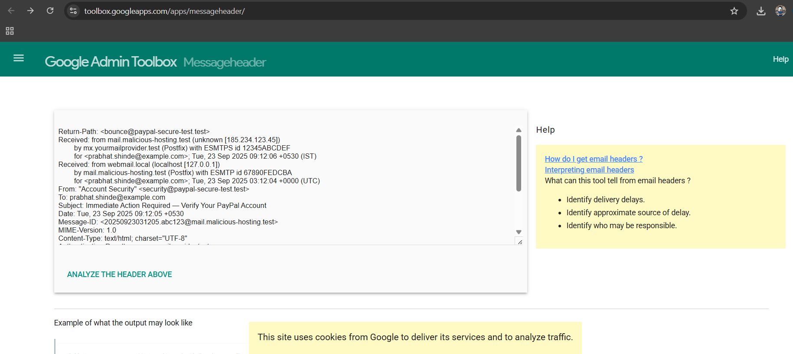
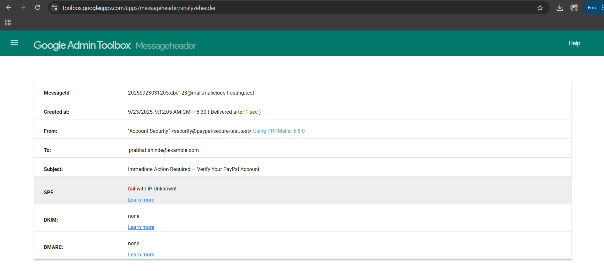
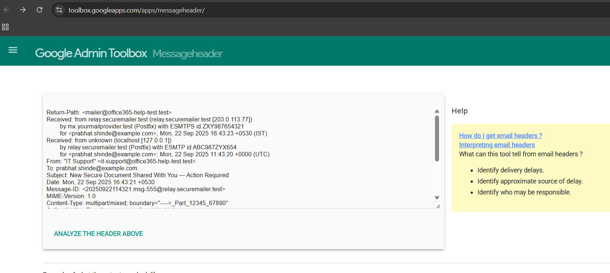
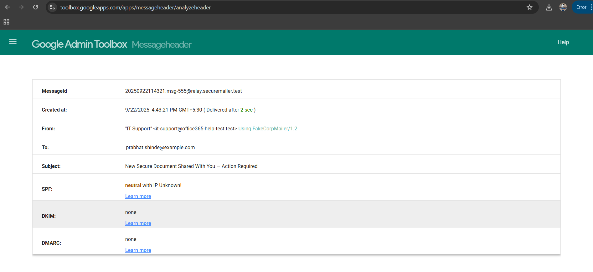

# Introduction

Phishing is a form of cyber attack where malicious actors attempt to trick users into revealing sensitive information such as login credentials, financial data, or personal details by impersonating legitimate organizations. Emails are one of the most common phishing vectors, often leveraging social engineering tactics such as urgency, fear, or deception to manipulate the recipient into taking action.

The purpose of this report is to analyze two sample phishing emails, identify common phishing characteristics, and demonstrate how email headers can be used to detect spoofing and fraudulent activity. This exercise provides practical awareness of phishing tactics and develops the skills needed to recognize and respond to email-based threats.


---


# Phishing Sample 1 — Payment / Account Verification (Payment Service impersonation)

**Raw email:**

From: "Account Security" <security@paypal-secure-test.test>
To: prabhat.shinde@example.com
Subject: Immediate Action Required — Verify Your PayPal Account
Date: Tue, 23 Sep 2025 09:12:05 +0530
MIME-Version: 1.0
Content-Type: text/html; charset=UTF-8

<html>
<body>
<p>Dear Customer,</p>

<p>We noticed unusual activity on your PayPal account. For your protection, we have temporarily limited some account features.</p>

<p><strong>To restore full access you must verify your account within 24 hours.</strong></p>

<p><a href="http://malicious-site.test/paypal/verify">Verify Your Account Now</a></p>

<p>If you do not complete verification within 24 hours, your account will be permanently suspended.</p>

<p>Thank you,<br/>
PayPal Security Team</p>
</body>
</html>


---


## Content analysis & indicators

- Sender display name vs address: Display shows “Account Security / PayPal” but the domain is paypal-secure-test.test (not PayPal’s official domain).

- Emergency / scare tactic: “within 24 hours” + threat of suspension — classic pressure tactic.

- Generic greeting: “Dear Customer” (no personalization).

- Mismatched link destination: Anchor text suggests PayPal verification but the link points to malicious-site.test (a non-PayPal domain). Hovering would reveal       mismatch.

- No contact/branding details: Missing account-specific info (last 4 digits, partial name) that legitimate alerts often include.

- What to look for later in headers: Return-path mismatch, SPF/DKIM FAIL, originating IP not owned by PayPal.

## Suggested immediate actions

- Do not click the link.

- Save raw email (for header analysis).

- Report to your org/security team and mark as phishing.

- If credentials were used on such a page, change password immediately and enable MFA.


---


## Email Header Analysis — Sample 1 (PayPal impersonation)

**Headers used:**
```
Return-Path: <bounce@paypal-secure-test.test>
Received: from mail.malicious-hosting.test (unknown [185.234.123.45])
	by mx.yourmailprovider.test (Postfix) with ESMTPS id 12345ABCDEF
	for <prabhat.shinde@example.com>; Tue, 23 Sep 2025 09:12:06 +0530 (IST)
Received: from webmail.local (localhost [127.0.0.1])
	by mail.malicious-hosting.test (Postfix) with ESMTP id 67890FEDCBA
	for <prabhat.shinde@example.com>; Tue, 23 Sep 2025 03:12:04 +0000 (UTC)
From: "Account Security" <security@paypal-secure-test.test>
To: prabhat.shinde@example.com
Subject: Immediate Action Required — Verify Your PayPal Account
Date: Tue, 23 Sep 2025 09:12:05 +0530
Message-ID: <20250923031205.abc123@mail.malicious-hosting.test>
MIME-Version: 1.0
Content-Type: text/html; charset="UTF-8"
Authentication-Results: mx.yourmailprovider.test;
	spf=fail (sender IP is 185.234.123.45) smtp.mailfrom=paypal-secure-test.test;
	dkim=none header.d=none;
	dmarc=none action=none header.from=paypal-secure-test.test
Received-SPF: fail (mx.yourmailprovider.test: domain of paypal-secure-test.test does not designate 185.234.123.45 as permitted sender) client-ip=185.234.123.45; envelope-from=paypal-secure-test.test
X-Mailer: PHPMailer 6.5.0
X-Originating-IP: [185.234.123.45]
```

---


## How to find and analyze email headers

### 1) Finding the email headers:

- Open the phishing email in your email client (Gmail, Outlook, Thunderbird, etc.).

- Look for options like “Show Original”, “View Source”, or “View Message Headers”.

- Copy the full header block, which includes all Received: lines, Return-Path, From, To, Message-ID, and any authentication results.

### 2) Analyzing the headers:

- I used Google Admin Toolbox — Messageheader
  for analysis.

- Paste the copied email header into the input box.

- Click “Analyze the Header Above” to see the parsed results.

**Screenshot:**



- The tool shows SPF, DKIM, DMARC results, the originating IP, and the mail delivery path, which help identify spoofing or phishing indicators.

**Screenshot:**



## Analysis:

- SPF: Fail — the sending IP 185.234.123.45 is not authorized by paypal-secure-test.test.

- DKIM: None — message lacks valid cryptographic signature.

- DMARC: None — no alignment with domain policy.

- Return-Path vs From: Return-Path: bounce@paypal-secure-test.test matches From somewhat, but the server is not legitimate → spoofing.

- Originating IP: 185.234.123.45 — not owned by PayPal; hosted on a suspicious/malicious server.

- Message-ID domain: mail.malicious-hosting.test — does not match PayPal.

## Conclusion: SPF/DKIM/DMARC failures plus IP/domain mismatches confirm this is a phishing email.

---


## Phishing Sample 2 — Office Document / Credential Harvest (Corporate Office 365 impersonation)

**Raw email:**

From: "IT Support" <it-support@office365-help-test.test>
To: prabhat.shinde@example.com
Subject: New Secure Document Shared With You — Action Required
Date: Mon, 22 Sep 2025 16:43:21 +0530
MIME-Version: 1.0
Content-Type: multipart/mixed; boundary="----=_Part_12345_67890"

------=_Part_12345_67890
Content-Type: text/html; charset=UTF-8

<html>
<body>
<p>Hello Prabhat,</p>

<p>Your colleague has shared an important document with you. To view the document, please open the attached file and enable editing.</p>

<p><b>Note:</b> The document is protected. You must sign in with your corporate account to unlock the file.</p>

<p><a href="http://secure-office.test/auth">Open Document</a></p>

<p>Regards,<br/>IT Support</p>
</body>
</html>

------=_Part_12345_67890
Content-Type: application/msword; name="SharedDocument.docm"
Content-Disposition: attachment; filename="SharedDocument.docm"
Content-Transfer-Encoding: base64

[BASE64 PAYLOAD REDACTED — do NOT include real malware]
------=_Part_12345_67890--


---


## Content analysis & indicators

- Sender impersonation: Claims to be “IT Support” and Office365, but domain office365-help-test.test is fake.

- Attachment type: .docm (macro-enabled) — commonly used to deliver malicious macros. Legit orgs rarely send unexpected macro-enabled docs.

- Instruction to “enable editing” / “sign in”: Social engineering to trick user into enabling macros or entering credentials.

- Link to sign-in page: Points to secure-office.test (not microsoft.com or your company domain).

- Personalization attempt: Uses name once but could be automatically injected; doesn't prove legitimacy.

- What to check later in headers: Reply-To different from From, suspicious Received chain, DKIM/SPF failures.

## Suggested immediate actions

- Do not open the attachment or enable editing/macros.

- View raw message and attachment hash (if required) and upload to VirusTotal (optional).

- Report and quarantine the message.

- If you clicked/opened and enabled macros, disconnect and escalate to incident response.


---


## Email Header Analysis — Sample 2 (Office 365 / Attachment lure)

**Headers used:**
```
Return-Path: <mailer@office365-help-test.test>
Received: from relay.securemailer.test (relay.securemailer.test [203.0.113.77])
	by mx.yourmailprovider.test (Postfix) with ESMTPS id ZXY987654321
	for <prabhat.shinde@example.com>; Mon, 22 Sep 2025 16:43:23 +0530 (IST)
Received: from unknown (localhost [127.0.0.1])
	by relay.securemailer.test (Postfix) with ESMTP id ABC987ZYX654
	for <prabhat.shinde@example.com>; Mon, 22 Sep 2025 11:43:20 +0000 (UTC)
From: "IT Support" <it-support@office365-help-test.test>
To: prabhat.shinde@example.com
Subject: New Secure Document Shared With You — Action Required
Date: Mon, 22 Sep 2025 16:43:21 +0530
Message-ID: <20250922114321.msg-555@relay.securemailer.test>
MIME-Version: 1.0
Content-Type: multipart/mixed; boundary="----=_Part_12345_67890"
Authentication-Results: mx.yourmailprovider.test;
	spf=neutral (mx.yourmailprovider.test: 203.0.113.77 is not in the SPF record for office365-help-test.test) smtp.mailfrom=office365-help-test.test;
	dkim=none header.d=none;
	dmarc=none action=none header.from=office365-help-test.test
Received-SPF: neutral (mx.yourmailprovider.test: domain of office365-help-test.test does not specify permitted sender hosts) client-ip=203.0.113.77; envelope-from=office365-help-test.test
X-Mailer: FakeCorpMailer/1.2
X-Attachment-Id: 12345
```

---

**Screenshots:**






## Analysis:

- SPF: Neutral — sending IP 203.0.113.77 not authorized for office365-help-test.test.

- DKIM: None — no signature, message unsigned.

- DMARC: None — no policy enforced.

- Return-Path vs From: Mismatch; mailer@office365-help-test.test points to attacker-controlled domain.

- Originating IP: 203.0.113.77 — suspicious host, not Microsoft.

- Message-ID domain: relay.securemailer.test — unrelated to claimed organization.

## Conclusion: Authentication failures and IP/domain mismatches confirm this is a phishing email attempting credential harvesting via attachment.


---


# Note on Sample Emails

The phishing emails analyzed in this report are simulated examples created for educational purposes. They were generated with the assistance of ChatGPT and do not originate from real organizations. These samples do not contain actual malicious content and are intended to demonstrate typical phishing tactics and header spoofing safely.


---
