# Introduction:

This is Task 3 of the Elevate Labs internship. Initially, my PC was not working, so I had to complete Tasks 1 and 2 on my laptop, where I had to download the required tools separately. Now that my PC has been repaired, I have Kali Linux installed on it inside VirtualBox.

For this task, I have also downloaded a few additional tools, including **Nessus**, which is a vulnerability scanner widely used for detecting known vulnerabilities in systems and applications. In this project, I will use Nessus to scan my device, identify potential vulnerabilities, and explore resolutions to secure the system.


---


## Tools Used

The following tools were used in this project:  

1. **Nessus** – Primary vulnerability scanner used to detect vulnerabilities, misconfigurations, and security issues.  
2. **Kali Linux (VirtualBox)** – Operating system and environment for running Nessus and other cybersecurity tools.  
3. **VirtualBox** – Virtualization software used to host Kali Linux on my low-end PC.  
4. **Web Browser** – To access the Nessus web interface (`https://localhost:8834`).


---


## Step 1 – Starting Nessus

The first thing I did was to start Nessus. I opened a terminal in my Kali Linux machine and ran the following command to start the Nessus service:

```
sudo systemctl start nessusd.service
```
After starting the service, I checked the status of Nessus to ensure it was running correctly by using:
```
sudo systemctl status nessusd.service
```
This confirmed that Nessus had started successfully and was ready for scanning.

 **Screenshot:**

 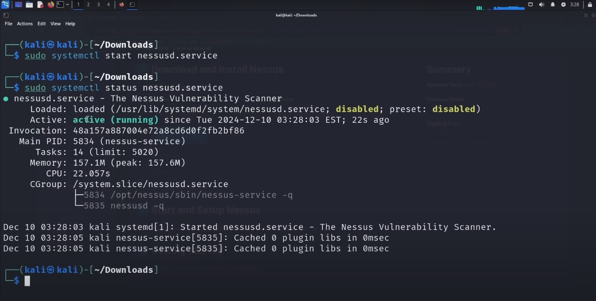


---


## Step 2 – Accessing Nessus Web Interface

Once Nessus was running, I accessed the Nessus web interface by opening a browser and entering the following URL:
```
https://localhost:8834
```

This opened the Nessus login page where I entered the required credentials. After completing the setup steps, I was able to log in successfully and access the Nessus dashboard.

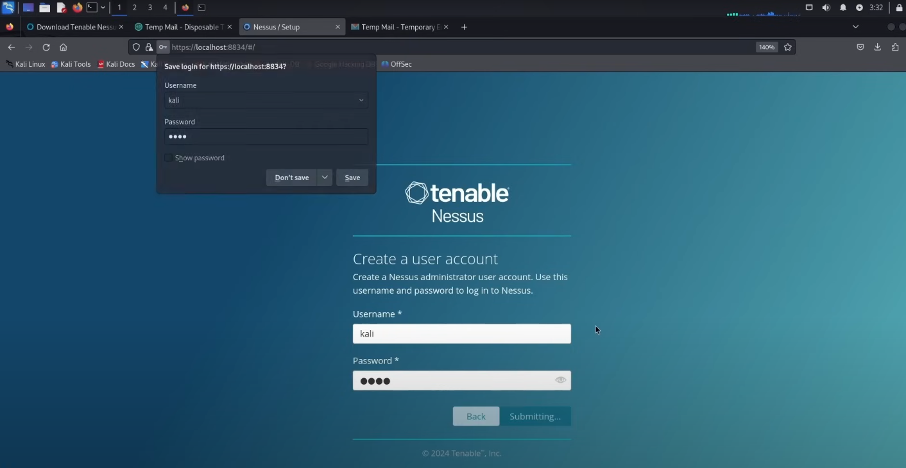

On the Nessus interface, different types of scans are available. For this project, I will be using the **Basic Network Scan** option.

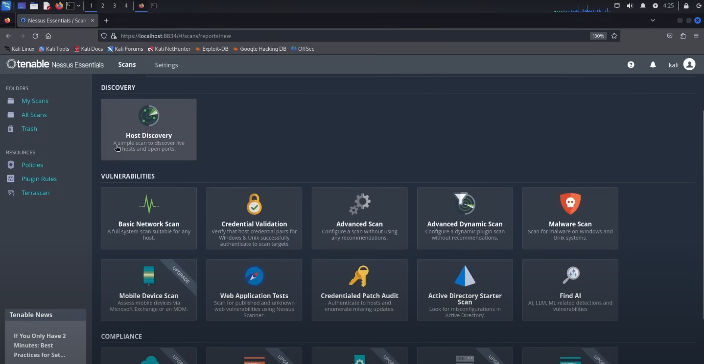


---


## Step 3 – Configuring the Basic Network Scan

After clicking on the **Basic Network Scan** option, Nessus opened the scan configuration interface.  

In the interface (shown in the screenshot below), there are three main fields:  
- **Settings**  
- **Credentials**  
- **Plugins**  

Inside the **Settings** field, several sub-sections are available for customization:  
- **Basic**  
- **Discovery**  
- **Assessment**  
- **Report**  
- **Advanced**  


Inside the **Basic** sub-section of **Settings**, there are a few more tabs: **General**, **Schedule**, and **Notification**.  
The screenshot shows the **General** tab where I configured the basic details for the scan.

In the **General** tab I completed the following fields:

- **Name**  
  I named the scan `scan 1`.

- **Description** (optional)  
  You can add a short description here for your reference or for others; this is not mandatory.

- **Folder**  
  Choose the folder where you want Nessus to save the scan results.

- **Targets** (important)  
  Enter the IP address (or range) of the device(s) you want to scan. For this project I scanned one of my own devices.

  **Note:** Scanning devices that you do **not** own or do not have explicit permission to test may be illegal and can have serious consequences. Only scan systems you own or have written authorization to test.


---


## Step 4 – Exploring Schedule and Notification Tabs

As explained earlier, within the **Basic** sub-section there are three tabs: **General**, **Schedule**, and **Notification**. We have already covered the **General** tab in the previous step. Now let’s go through the other two:

- **Schedule**  
  This section allows you to schedule the scan to run at a specific time or on a recurring basis. By default, scheduling is turned off. However, if you enable it, you can configure the exact timing (date, time, and frequency) for when Nessus should automatically run the scan.  

  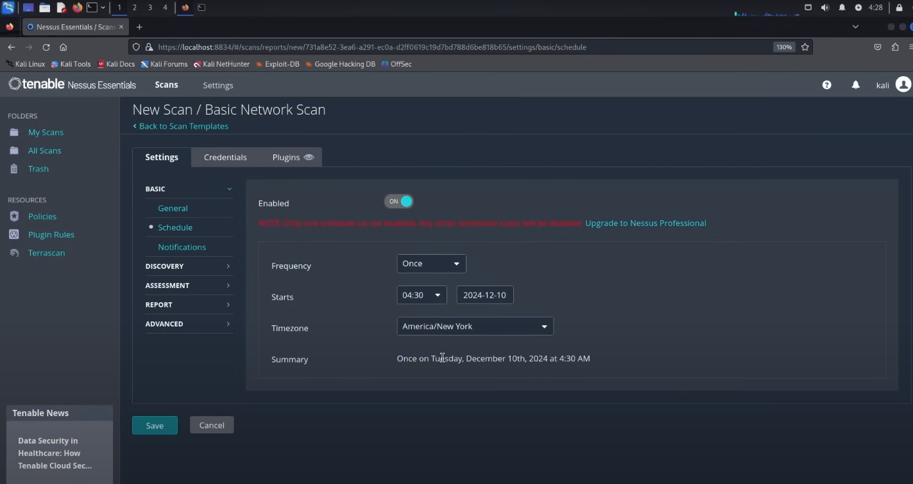

- **Notification**  
  This section allows you to set up email notifications. Here, you can enter an email address where Nessus will send updates or results once the scan is complete. This is useful for keeping track of scan outcomes without manually logging into the interface.  

  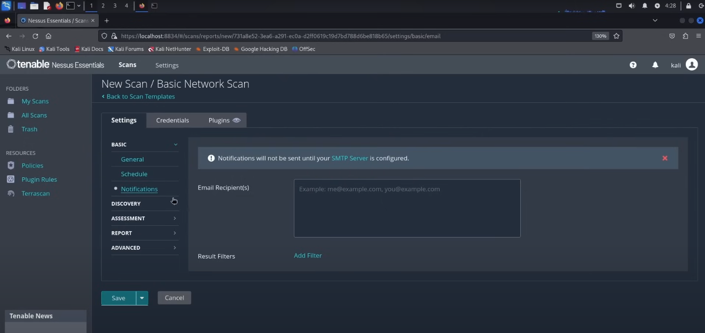


---


## Step 5 – Discovery Sub-section

The next sub-section under **Settings** is **Discovery**. This section is used to define how Nessus should scan the network and which ports it should analyze. There are three options available:

1. **Port scan (common ports)**  
   This option tells Nessus to scan only the most commonly used ports (e.g., 21 for FTP, 22 for SSH, 80 for HTTP, 443 for HTTPS, etc.). It is faster than scanning all ports and is generally sufficient to detect the majority of vulnerabilities.  
   *For this project, I selected this option to prevent performance issues on my low-end PC running Kali Linux inside VirtualBox.*

2. **Port scan (all ports)**  
   This option scans all 65,535 TCP ports on the target. While it provides complete coverage, it takes significantly more time to finish compared to scanning just the common ports.

3. **Custom**  
   With this option, you can specify exactly which ports you want Nessus to scan. This is useful if you want to target specific services or applications running on certain ports.

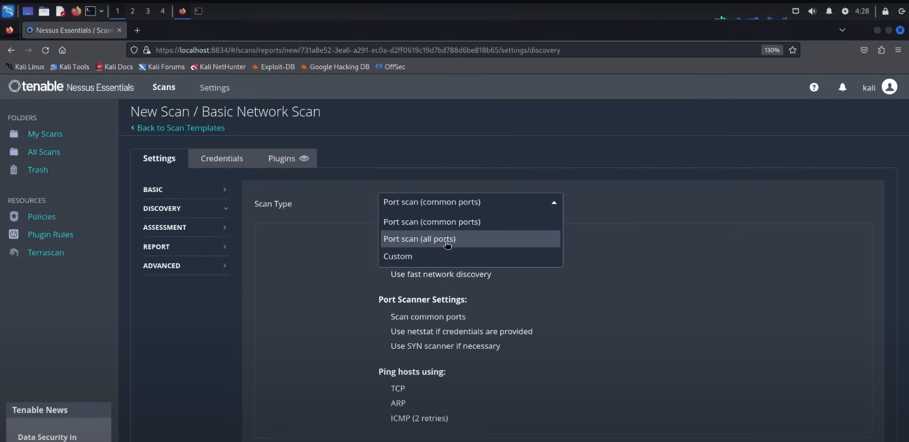


---


## Step 6 – Assessment Sub-section

The next sub-section under **Settings** is **Assessment**. This section defines **how Nessus will check the discovered services for vulnerabilities**. There are several options for the scan type:

1. **Default**  
   Runs a standard set of vulnerability checks based on the chosen scan template.

2. **Scan for known vulnerabilities**  
   This option runs Nessus plugins to detect **all known vulnerabilities** on the target system.  
   *For this project, I selected this option.*

3. **Scan for known vulnerabilities (quick)**  
   Runs a faster version of the known vulnerabilities scan. It may skip some checks to reduce scan time.

4. **Scan for known vulnerabilities (complex)**  
   Performs a more thorough scan, including some advanced checks that may take longer to complete.

5. **Custom**  
   Allows the user to choose specific vulnerability plugins to run, useful for targeted testing.

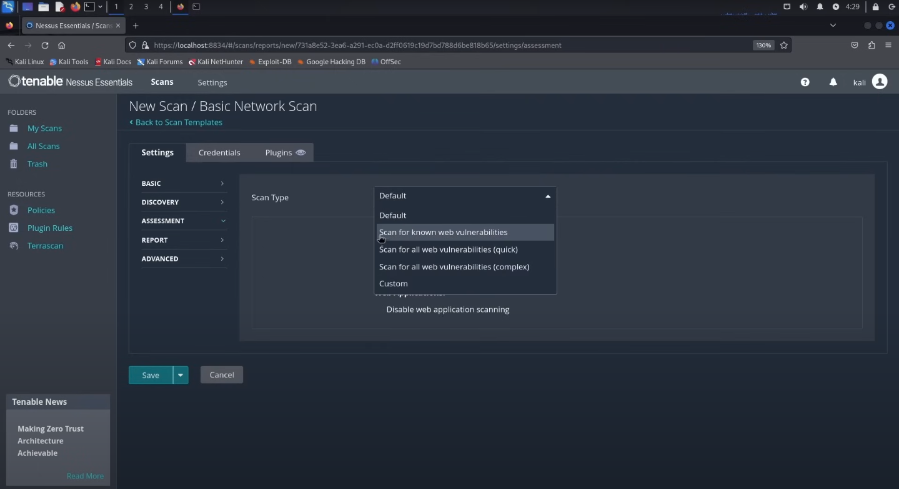


---


## Step 7 – Report and Advanced Sub-sections

### Report Sub-section
The next sub-section under **Settings** is **Report**. This section allows you to customize what details will be included in the final Nessus scan report.  

For this project, I kept all the default fields checked and did not make any changes. The default settings provide a comprehensive report with vulnerability details, summaries, and risk levels. You can modify these options if you want to include/exclude certain information in the report.

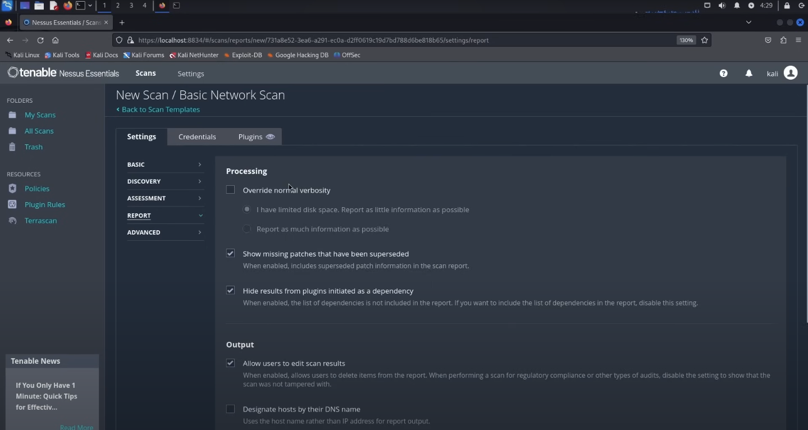

---

### Advanced Sub-section
The final sub-section under **Settings** is **Advanced**. Here, you can control additional scan behaviors, including how Nessus interacts with the network. One of the key options is the **scan type**, with the following choices:

1. **Default** – Runs the scan using Nessus’s standard configuration.  
   *For this project, I selected this option.*

2. **Scan low bandwidth links** – Optimizes the scan to use less network bandwidth. Useful for slower networks.  

3. **Custom** – Allows you to manually configure advanced scan settings.

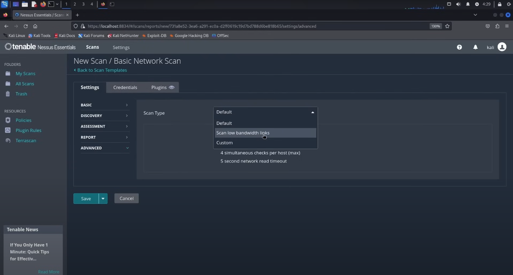


---


## Step 8 – Credentials and Plugins Field

### Credentials

After completing the **Settings** field, the next important section in Nessus is **Credentials**. This section allows Nessus to log into the target system using valid credentials, which enables a more thorough scan known as a **credentialed scan**. Credentialed scans can detect vulnerabilities that are not visible from an external perspective, such as missing patches, misconfigurations, or weak passwords.

Key points about the **Credentials** field:

- **Filter / Search Bar** – You can search for specific credential types using the filter bar.  
- **Categories** – By default, the host category is selected, but you can change it depending on what system or service you want to scan.  
- **Credential Types** – Common options include:  
  - **SSH** – Used for Linux/Unix hosts; you would provide a username and private key or password.  
  - **Windows** – Used for Windows hosts; you provide a username and password to allow Nessus to log in.  

For this project, I did not add any credentials, so the scan was performed as an **uncredentialed scan**.   


### Plugins Field

The final field in Step 8 is **Plugins**. Plugins in Nessus are small scripts that perform specific vulnerability checks on the target system. Each plugin corresponds to a particular type of vulnerability, configuration issue, or security check.

Key points about the **Plugins** field:

- **Categories** – Plugins are organized into categories, such as `Firewalls`, `FTP`, `General`, `Gentoo Local Security Checks`, and many more. These categories help you select which types of vulnerabilities to scan for.  
- **Numbers next to each category** – The numbers (e.g., 566) indicate the total number of individual plugins available within that category. This tells you how many checks Nessus will perform if that category is selected.  
- **Selection** – You can choose to enable or disable entire categories or individual plugins, depending on what you want to scan. By default, Nessus enables most relevant plugins to cover common vulnerabilities.  

For this project, I did not make any changes in the Plugins section and used the default selections. This ensures that Nessus ran a broad set of vulnerability checks across multiple categories.  

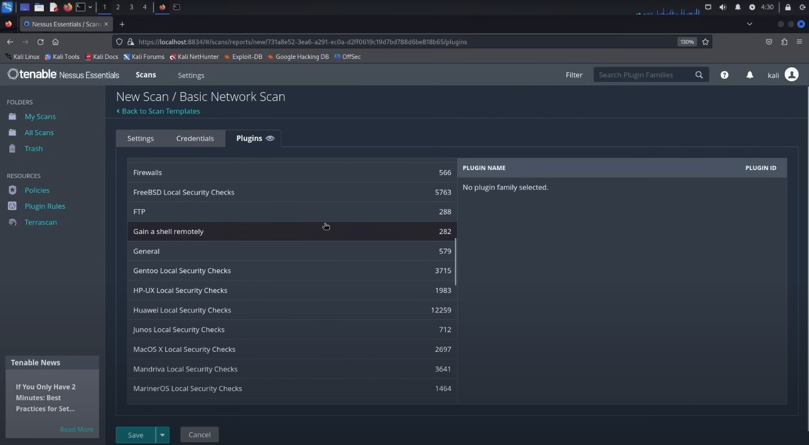


---


## Step 9 – Running the Scan and Viewing Results

After completing all the necessary configuration, the scan can be saved and launched:

1. Go to **My Scans** in the Nessus dashboard.  
2. Locate your scan, in this case, **"scan 1"** (as shown in the screenshot below).  
3. Select the scan and click the **Launch** button on the top-right corner of the next page.

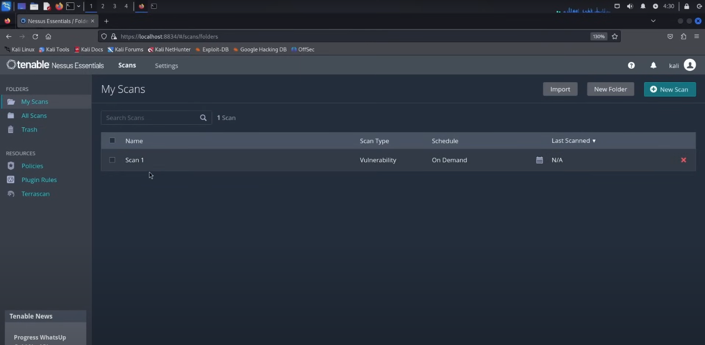

The scan will take some time to complete. The duration depends on:  
- The type of scan selected  
- Sections and sub-fields configured (e.g., plugins, discovery, assessment)  
- Performance of the device running Nessus  

Once the scan is completed, the results interface appears. Each target is displayed with a **colorful bar**, indicating the severity of vulnerabilities discovered:

- **Red** – Critical vulnerabilities  
- **Orange / Dark Yellow** – High severity vulnerabilities  
- **Dark Yellow** – Medium severity vulnerabilities  
- **Yellow** – Low severity vulnerabilities
- **Info** - Information

For example, in the scan results for this project, there were **10 critical vulnerabilities** (shown in red). The colored bar provides a quick visual summary of the overall risk on the target device.  

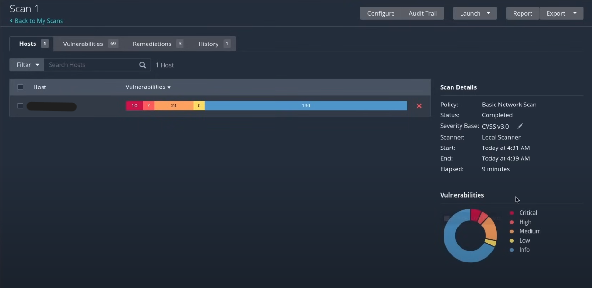


---


## Step 10 – Reviewing Vulnerabilities and Resolutions

Once the scan is complete, clicking on **"scan 1"** results displays a detailed list of all vulnerabilities discovered on the target device. The interface provides important information for each finding, including:  

- **Severity** – Indicates the risk level (Critical, High, Medium, Low, Info).  
- **CVSS Score** – The Common Vulnerability Scoring System score (0.0 to 10.0) representing the severity.  
- **Name** – The title of the vulnerability.  
- **Family** – The category or type of vulnerability (e.g., Backdoors, Configuration Issues, Services).  
- **Count** – Number of instances detected on the target.

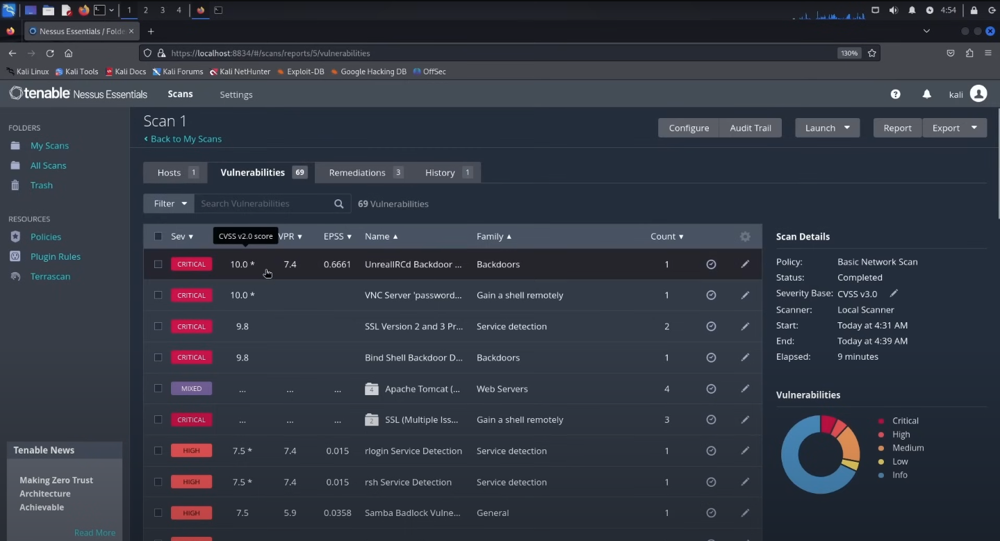

### Example: Critical Vulnerability

One of the critical vulnerabilities found in this scan is **"UnrealIRCD Backdoor Detection"**.  

- **CVSS Score:** 10.0 (critical)  
- **Description:** The scan provides a brief description of the vulnerability, explaining what it is, how it can affect the system, and why it is dangerous.  
- **Resolution:** Nessus also provides a recommended solution. In this case:  
  > "Re-download the software, verify using the published MD5/SHA-1 checksums, and reinstall it."  
- **See Also:** This section contains links to external resources or detailed explanations about the vulnerability.  
- **Output:** This section shows technical details of how Nessus detected the vulnerability, often including raw packet captures, logs, or scripts. It’s mostly for advanced users or auditors to verify the detection method.  

This example demonstrates how Nessus not only identifies vulnerabilities but also provides actionable guidance to remediate them, making it easier to secure the system effectively.  

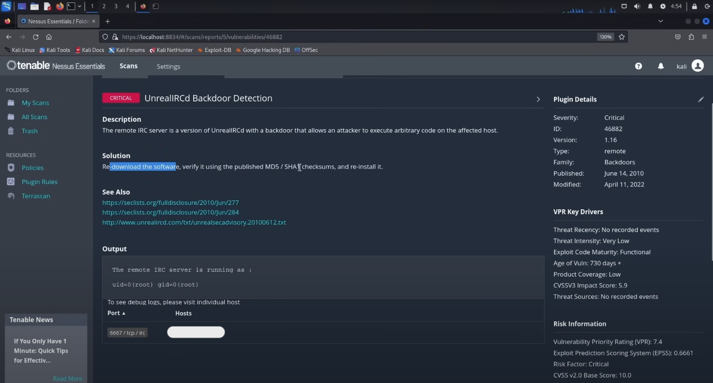


---


## Step 11 – Mixed Vulnerabilities

In addition to individual vulnerabilities, Nessus also groups some findings under **Mixed** severity, which is displayed in **purple** in the scan results interface.  

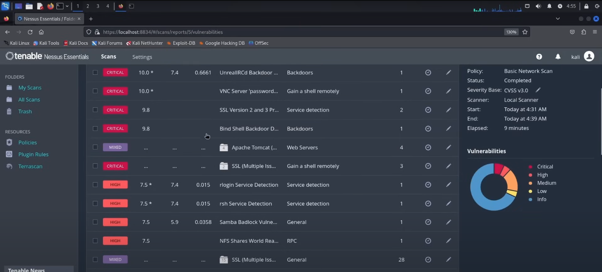

A **Mixed vulnerability** occurs when Nessus detects multiple issues affecting the same target or service. Essentially, it represents a group of vulnerabilities bundled together for easier review.  

For example, in this project, clicking on a mixed severity finding revealed **four vulnerabilities**:  
- **2 Critical (Red)**  
- **1 Medium (Dark Yellow**  
- **1 Info (Blue)**  

This grouping allows you to see all related vulnerabilities in one place, making it easier to prioritize remediation efforts.  

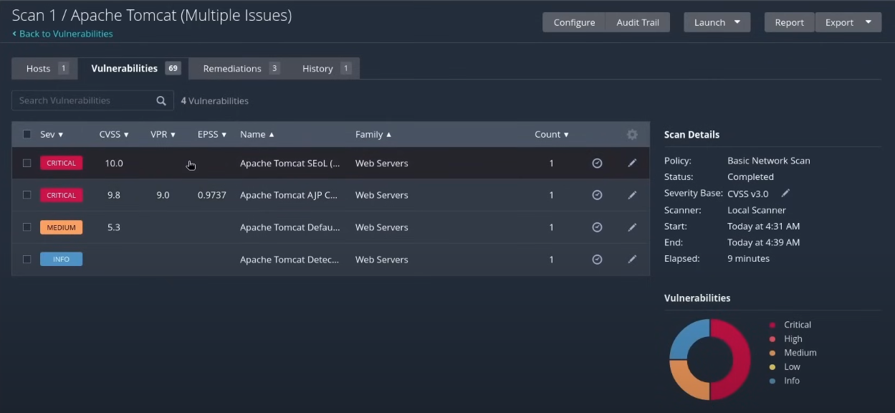

### Reviewing Individual Vulnerabilities within a Mixed Finding

Just like the **"UnrealIRCD Backdoor Detection"** example from Step 10, each vulnerability inside a mixed severity group has its own:  

- **Description** – Explains the nature of the vulnerability, how it affects the system, and why it is important.  
- **Resolution** – Provides actionable steps to fix or mitigate the vulnerability.  
- **See Also** – Links to external resources or detailed information for deeper understanding.  
- **Output** – Shows technical details of how Nessus detected the vulnerability, including logs, scripts, or raw data.  

This structure allows you to carefully examine and remediate each vulnerability, even when they are grouped together under a mixed severity category.  

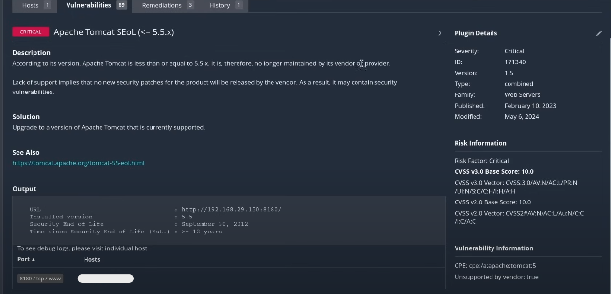


---


## Conclusion

In this task, I conducted a **full vulnerability assessment** of my own device using Nessus. The project included:  

- Setting up and configuring a **Basic Network Scan**  
- Exploring all relevant sections such as **Settings, Credentials, Plugins, Report, and Advanced options**  
- Launching the scan and reviewing the **scan results**, including individual vulnerabilities, severity levels, and mixed severity findings  
- Analyzing vulnerabilities with **CVSS scores, descriptions, resolutions, and references**  

The scan identified **69 vulnerabilities**, including **critical, high, medium, low and informational issues**. Nessus also provided detailed guidance for resolving each vulnerability, demonstrating its usefulness as a vulnerability management tool.  

This exercise reinforced the importance of:  
- Performing **vulnerability scanning on devices you own or have permission to scan**  
- Understanding how **scan configuration and resource limitations** affect scan results  
- Prioritizing remediation based on **severity and CVSS scores**


---


