# Setup and Use a Firewall on Windows

## Introduction
In this task, the objective was to **configure and test basic firewall rules** on Windows to allow or block specific network traffic. The task helped in understanding how firewalls filter traffic based on ports, protocols, and connection direction, providing hands-on experience with firewall management.

## Tools Used
- **Windows Defender Firewall with Advanced Security** (built-in Windows tool)
- **Telnet Client** (to test port connectivity via Command Prompt)

## Step 1: Open Windows Firewall Advanced Settings

1. Press **Windows key + R** to open the **Run** dialog box.

2. Type:
```
wf.msc
```
and press **Enter**.

**Screenshot:**

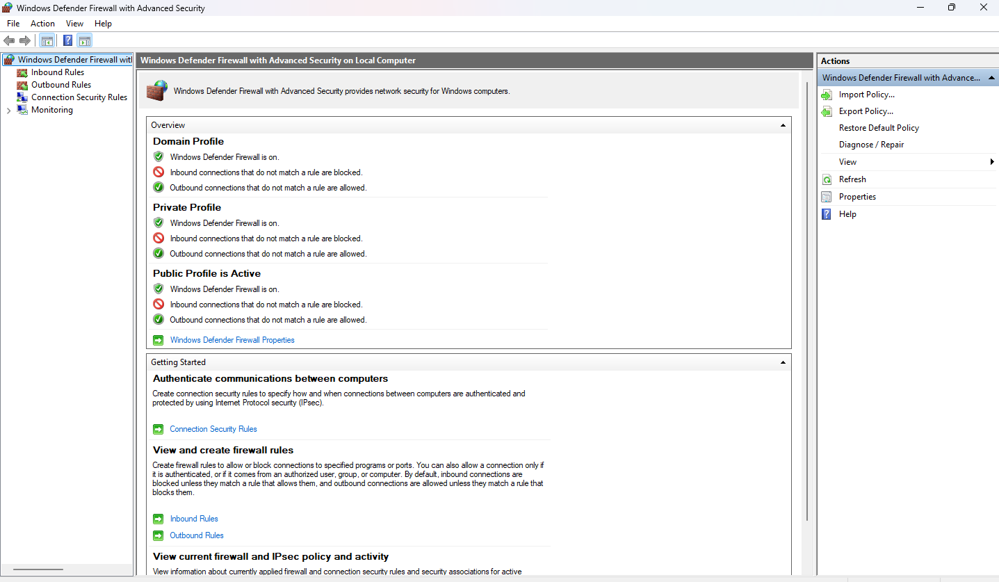

3. This launched **Windows Defender Firewall with Advanced Security**, which is the central interface to view and manage inbound and outbound firewall rules.


---


## Step 2: View Current Firewall Rules
1. In the **Windows Defender Firewall with Advanced Security** window, click on **Inbound Rules** on the left panel.  
   **Screenshot:**  
   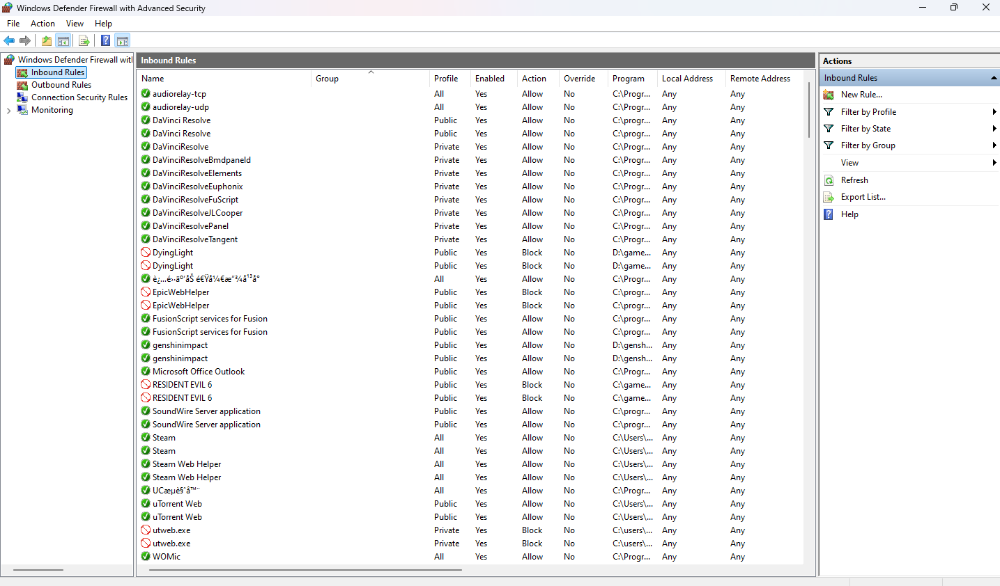

2. Click on **Outbound Rules** to view outgoing traffic rules.  
   **Screenshot:**  
   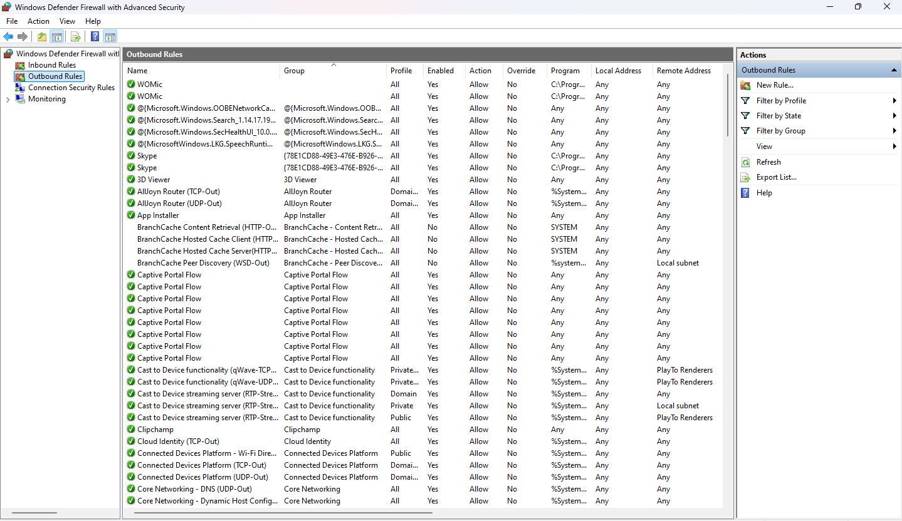

**Explanation:**  
- **Inbound Rules** control the traffic **coming into your computer** from the network. They determine which external connections are allowed or blocked.  
- **Outbound Rules** control the traffic **leaving your computer** to the network. They determine which applications or services can send data outside.  
- These rules are essential for protecting your system from unauthorized access and controlling network communications.


---


## Step 3: Add a Firewall Rule to Block Inbound Traffic (Port 23 - Telnet)

1. In **Inbound Rules**, click on **New Rule…** on the right-hand side.  


2. In the new window, select **Port** → click **Next**.

**Screenshot:**  
   
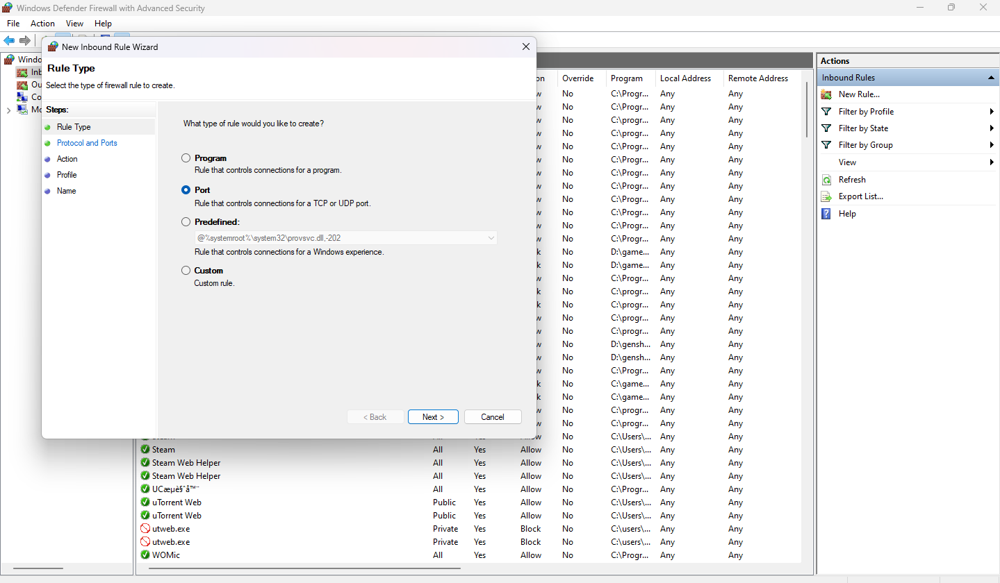

3. Choose **TCP**, and in **Specific local ports** type:
```
23
```
Click **Next**.  

**Screenshot:**  

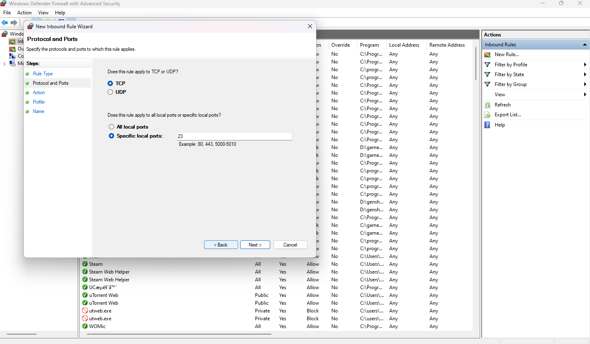

4. Select **Block the connection** → click **Next**.

**Screenshot:**  


 

5. On the next window, keep all three profiles checked: **Domain, Private, Public** → click **Next**.  

**Screenshot:**  

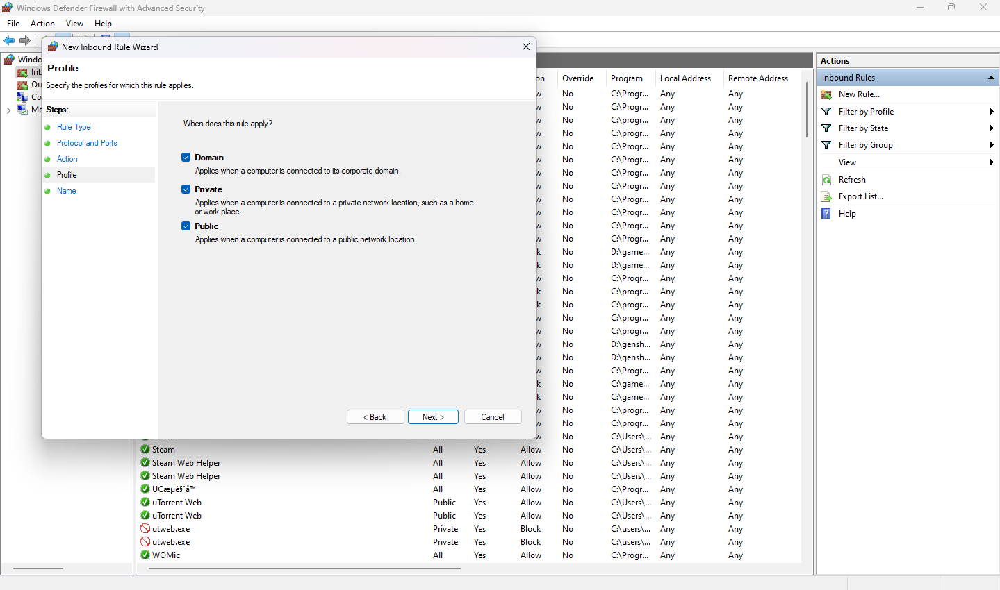

6. Name the rule (for example: **Block Telnet Port 23**). Optionally, add a description → click **Finish**.  

**Screenshot:**  

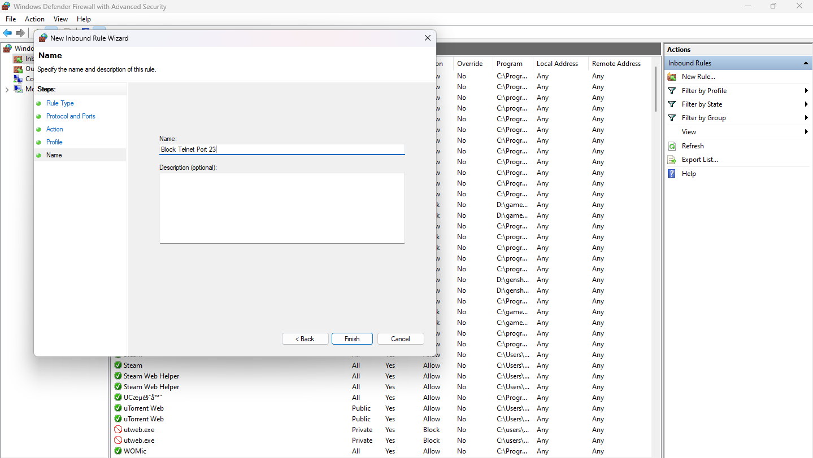

7. The new rule now appears at the top of the **Inbound Rules** list.  

**Screenshot:**  

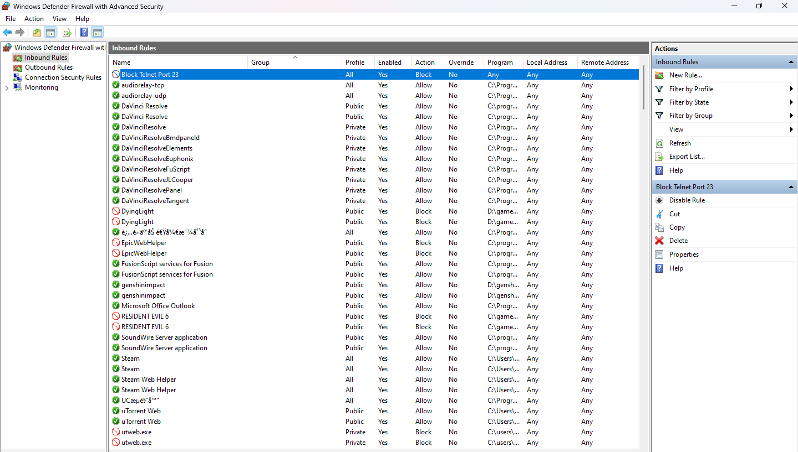


---


## Step 4: Test the Firewall Rule

1. Make sure the **Telnet Client** is installed on your Windows system:  
   - Press **Windows key + R**, type:  
     ```
     optionalfeatures
     ```  
   - Scroll down and check **Telnet Client**, then click **OK** to install if not already installed.  
   
   **Screenshot:**  

    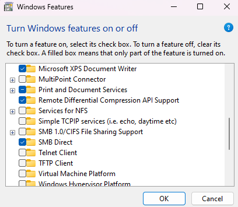

3. Open **Command Prompt** and try to connect to port 23 using Telnet:
```
telnet localhost 23
```

**Expected Result:** The connection should **fail**, indicating that the firewall rule is successfully blocking the port.  

**Screenshot:**  

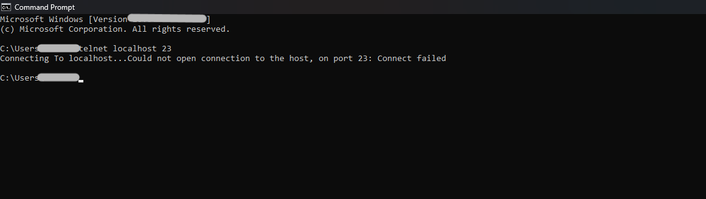

**Explanation:**  
- Since we blocked inbound traffic on port 23, any attempt to connect via Telnet to this port will fail.  
- This confirms that the firewall rule is working correctly.


---


## Step 5: Remove the Firewall Rule (Restore Original State)

1. Open **Windows Defender Firewall with Advanced Security**.  
2. Click on **Inbound Rules** on the left panel.  
3. Locate the rule you created (**Block Telnet Port 23**).  
4. Right-click on the rule → select **Delete** → confirm the deletion.  

   **Screenshot:**  

   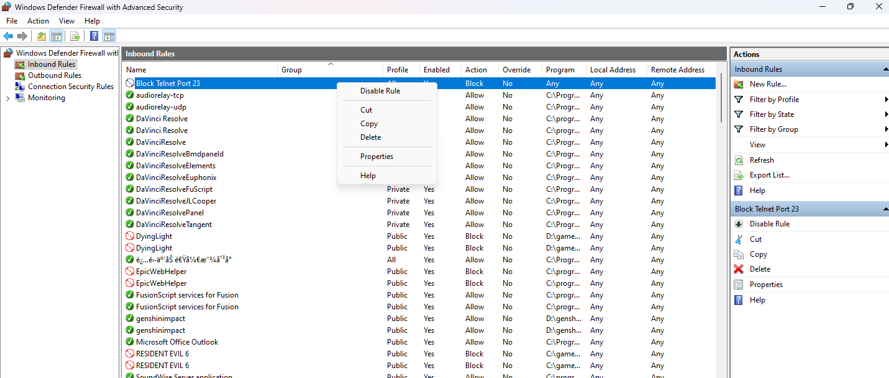

**Explanation:**  
- Deleting the rule restores the firewall to its original state.  
- This ensures that no ports remain unintentionally blocked, keeping your system configuration clean.


---


## Conclusion

In this task, I successfully configured and tested a basic firewall rule on Windows to block inbound traffic on port 23 (Telnet). The steps included:

- Viewing existing inbound and outbound firewall rules.  
- Creating a new inbound rule to block a specific port.  
- Testing the rule using Telnet to verify that the connection was blocked.  
- Deleting the rule to restore the firewall to its original state.  

**Outcome:**  
- Gained practical experience in managing Windows Firewall rules.  
- Learned how firewalls control incoming and outgoing traffic to protect the system.  
- Understood how to allow or block traffic on specific ports and the importance of testing rules to ensure they work as intended.

 


