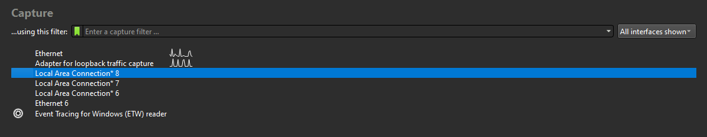
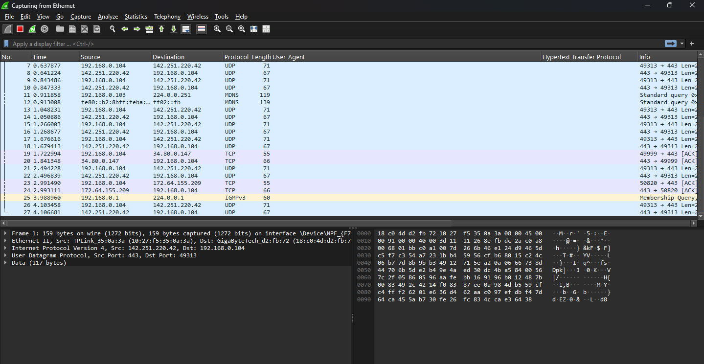
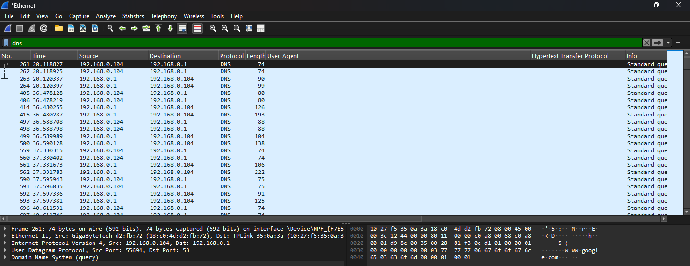
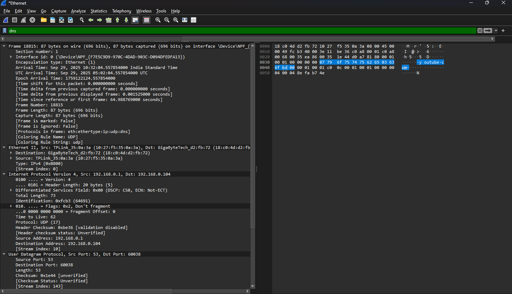
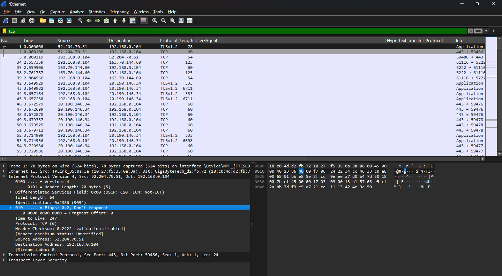
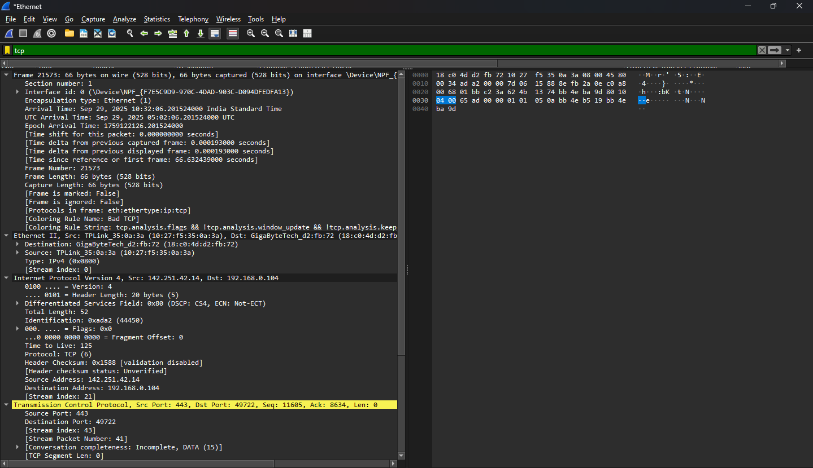
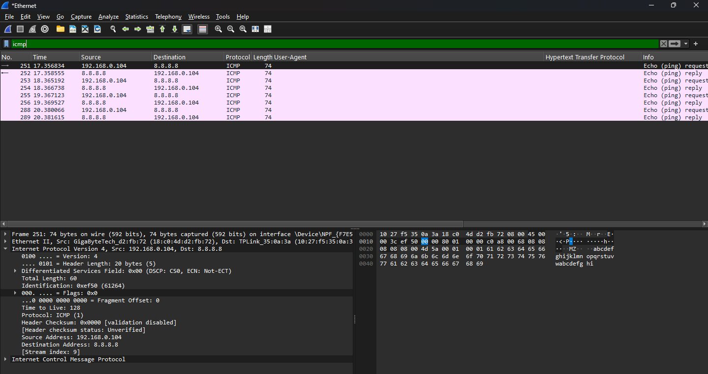
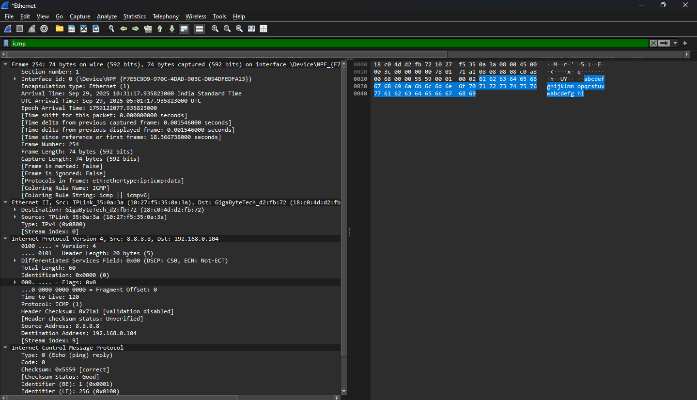
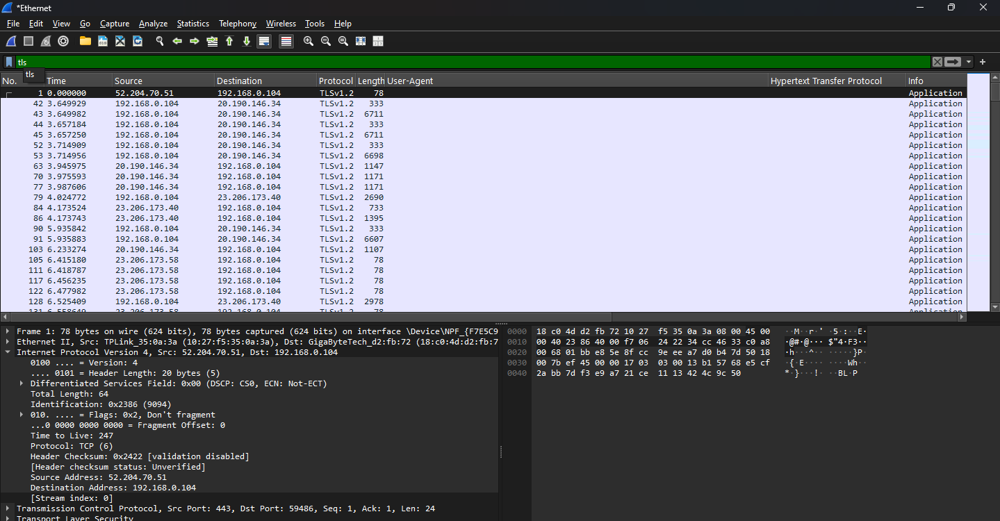
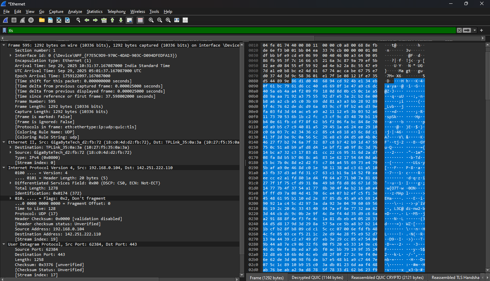

# Capture and Analyze Network Traffic Using Wireshark

## Introduction
In this task, I captured and analyzed live network traffic to develop a deeper understanding of network protocols and packet-level communication. The primary objective was to identify at least three different protocols in real-time network traffic, understand their function, and observe the interaction between my computer and external servers. This exercise enhanced my practical skills in network traffic analysis and protocol identification.

**Key learning outcomes included:**
- Hands-on experience with packet capture and filtering.
- Identification of different protocols such as DNS, TCP, ICMP, and TLS/HTTPS.
- Understanding the flow of network traffic between a client and server.
- Familiarity with Wireshark’s interface, filters, and packet analysis capabilities.

## Tools Used
- **Wireshark** – a network protocol analyzer used to capture and inspect live traffic.
- **Command Prompt / PowerShell** – to generate network traffic via ping commands.
- **Web Browser (Chrome)** – to access websites like YouTube, generating HTTP/HTTPS and DNS traffic.


---


## Step 1: Install Wireshark and Start Packet Capture

For this task, I used **Wireshark**, a network protocol analyzer, to capture live network traffic. Since I already had Wireshark installed on my PC, I did not need to perform a fresh installation. For reference, the latest version of Wireshark can be downloaded here: [Wireshark Download](https://www.wireshark.org/download.html).

In a previous task (Task 1 of this internship), I performed a packet capture on a laptop because my PC was not working at the time. During that capture, I selected the **Wi-Fi interface** to generate and capture network traffic.  

**Screenshot:**



This time, using my PC, I selected the **Ethernet interface** to perform the capture. To start capturing packets, I clicked on the **shark fin icon** on the interface, which immediately began recording all network traffic passing through the selected interface.  

**Screenshot:**




---


## Step 2: Generate Network Traffic

After starting the packet capture, I generated network traffic to ensure a variety of protocols would appear in the capture. To do this, I used **PowerShell** and executed the following command:

```powershell
ping 8.8.8.8
```
**Screenshot:**


The purpose of this command was to generate ICMP traffic, which is used for network diagnostic purposes. By pinging 8.8.8.8 (Google's public DNS server), my PC sent ICMP Echo Request packets and received Echo Reply packets in response. This allowed me to capture ICMP protocol packets in Wireshark, which are essential for analyzing network connectivity and observing packet-level interactions between my PC and an external server.


---


## Step 4: Filtering and Inspecting Protocols

### Protocol 1: DNS

**Domain Name System (DNS)** is a protocol that translates human-readable domain names (like `youtube.com`) into IP addresses that computers use to communicate over the network. DNS is essential for web browsing because every time a website is accessed, the browser must first resolve the domain name into its corresponding server IP.

During this capture, I performed a DNS query by opening Chrome and searching for `youtube.com`. Using the **`dns` filter** in Wireshark, I was able to isolate all DNS packets.  

**Screenshot:**  

  

#### Packet Inspection

I selected a DNS packet related to `youtube.com` for detailed analysis. In the **Info column**, it showed the query name as `youtube.com`. On the right-hand panel, the packet’s detailed tree structure contained multiple sections:

- **Frame**: Provides basic information about the packet, including timestamp, length, and protocol type.  
- **Ethernet II**: Displays the source and destination MAC addresses, indicating the local network communication.  
- **Internet Protocol (IP)**: Shows the source IP (my computer) and the destination IP (DNS server, e.g., `8.8.8.8`), as well as other IP-level details.  
- **Domain Name System (query)**: Contains the actual DNS query for `youtube.com`, including query type and class, as well as the response if available.  

This packet demonstrates how DNS resolves domain names into IP addresses, allowing my computer to establish a connection with the YouTube server.  

**Screenshot:**  
 



---


### Protocol 2: TCP

**Transmission Control Protocol (TCP)** is a connection-oriented protocol that ensures reliable data transmission between a client and a server. TCP manages packet sequencing, delivery acknowledgment, and connection establishment via a handshake process.

To observe TCP traffic, I applied the **`tcp` filter** in Wireshark. Among the captured packets, I identified one related to a connection with a YouTube server.  

**Screenshot:**  



The selected packet (No. 21573) provides evidence of TCP communication between my computer and the server:

- **Source IP:** 142.251.42.14 (YouTube server)  
- **Destination IP:** 192.168.0.104 (my computer)  
- **Protocol:** TCP  
- **Port Info:** 443 → 49722  
  - 443 = HTTPS port on YouTube server  
  - 49722 = ephemeral port on my PC  
- **Flags:** [ACK] — this packet acknowledges data previously sent; although not the initial SYN handshake, it confirms an active TCP session.  
- **Seq / Ack numbers:** part of TCP session sequencing.  

#### Packet Tree Details

Expanding the packet tree revealed several important sections:  

- **Frame:** Basic packet information including timestamp and length.  
- **Ethernet II:** Source and destination MAC addresses for local network communication.  
- **Internet Protocol (IP):** Source and destination IP addresses, protocol type, and other IP-level details.  
- **Transmission Control Protocol (TCP):** Contains port numbers, flags, sequence numbers, acknowledgment numbers, and window size, which collectively represent the state of the TCP session.  

This packet demonstrates that my computer successfully communicated with YouTube over TCP, validating the protocol’s operation in real-time traffic capture.  

**Screenshot:**  




---


### Protocol 3: ICMP

**Internet Control Message Protocol (ICMP)** is used for network diagnostics and error reporting. It allows devices to send control messages, such as ping requests and replies, to test connectivity and measure round-trip times.

During this capture, I generated ICMP traffic by executing the following command in **PowerShell**(Previously mentioned):

```powershell
ping 8.8.8.8
```
This produced ICMP Echo Request packets from my computer and ICMP Echo Reply packets from the target server (8.8.8.8). To analyze ICMP traffic, I applied the icmp filter in Wireshark and selected a packet with Source IP: 8.8.8.8 for detailed inspection.

**Screenshot:**



### Packet Tree Details

**Expanding the packet tree revealed the following sections:**

- Frame: Displays the packet’s timestamp, length, and protocol type.

- Ethernet II: Shows source and destination MAC addresses for local network communication.

- Internet Protocol (IP): Includes the source and destination IP addresses, protocol type, and other IP-level details.

**Internet Control Message Protocol (ICMP):** Contains type (Echo Reply), code, checksum, identifier, and sequence number. This section confirms that the packet is an ICMP Echo Reply from 8.8.8.8 responding to my computer’s ping request.

This packet demonstrates the successful delivery and response of ICMP messages, validating network connectivity with the external server.

**Screenshot:**




---


### Protocol 4: TLS/HTTPS

**Transport Layer Security (TLS)** is a cryptographic protocol that ensures secure communication over the network. It provides encryption, authentication, and data integrity between a client and a server, commonly used in HTTPS connections for web browsing.

To observe TLS traffic, I applied the **`tls` filter** in Wireshark.  

**Screenshot (after applying TLS filter):**  



Using the knowledge of the YouTube server IP (`142.251.42.14`), I identified a TLS packet with **Destination IP: 142.251.42.14**. I opened this packet to analyze its detailed structure.  

#### Packet Tree Details

Expanding the packet tree revealed several important sections:

- **Frame:** Shows basic information about the packet, including timestamp, length, and protocol type.  
- **Ethernet II:** Displays source and destination MAC addresses.  
- **Internet Protocol (IP):** Shows source and destination IP addresses, confirming communication with the YouTube server.  
- **Transport Layer Security (TLS):** Contains the TLS handshake information, such as the Client Hello message, cipher suites, and protocol version. This confirms that my computer initiated a secure HTTPS session with the server.  

**Screenshot (detailed packet tree):**  




---


## Conclusion

In this task, I successfully captured and analyzed live network traffic using Wireshark, gaining practical experience with multiple network protocols. By filtering and inspecting DNS, TCP, ICMP, and TLS packets, I was able to:

- Observe how **DNS** resolves human-readable domain names to IP addresses.  
- Understand **TCP** session communication between my computer and external servers, including port usage and acknowledgment mechanisms.  
- Validate network connectivity through **ICMP** Echo Requests and Replies.  
- Analyze secure communication using **TLS**, observing handshake messages and encryption setup.  

This exercise enhanced my understanding of network traffic flow, protocol functionality, and packet-level analysis. The practical experience with Wireshark reinforced my ability to capture, filter, and interpret network packets, which are essential skills for any cybersecurity or network analysis role.  

Overall, Task 5 strengthened my hands-on skills in network monitoring, protocol identification, and secure traffic analysis, preparing me for real-world scenarios in network security and troubleshooting.


---


