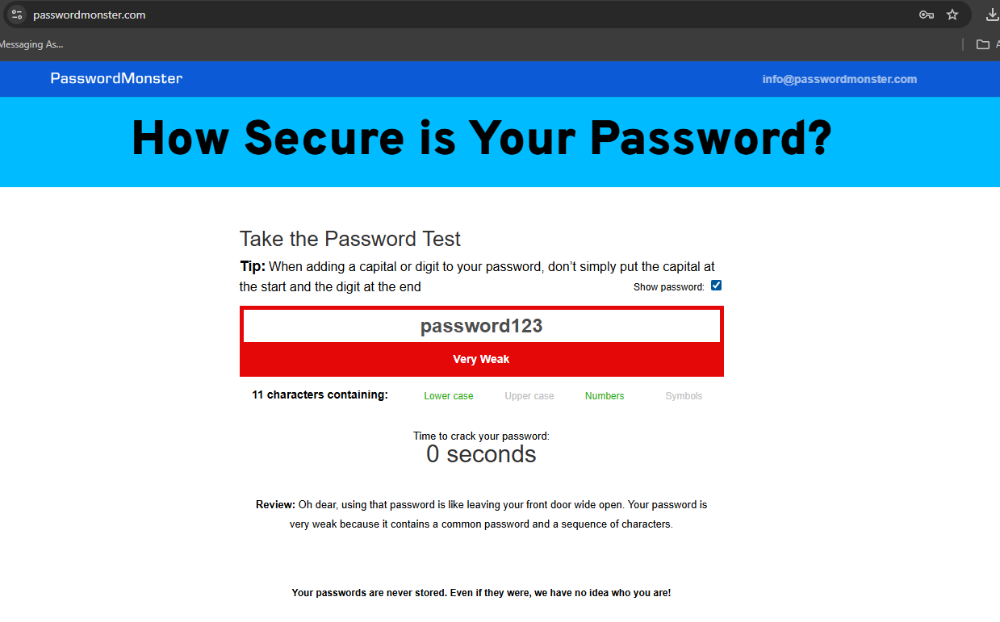
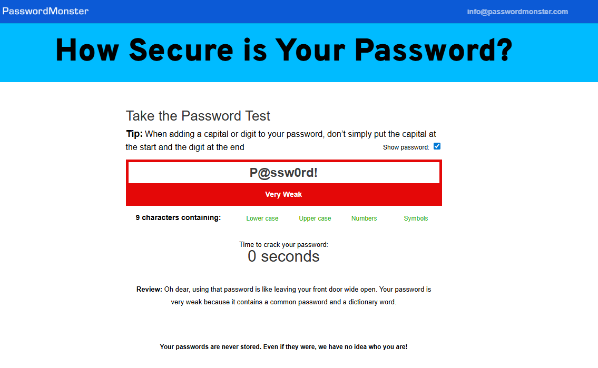
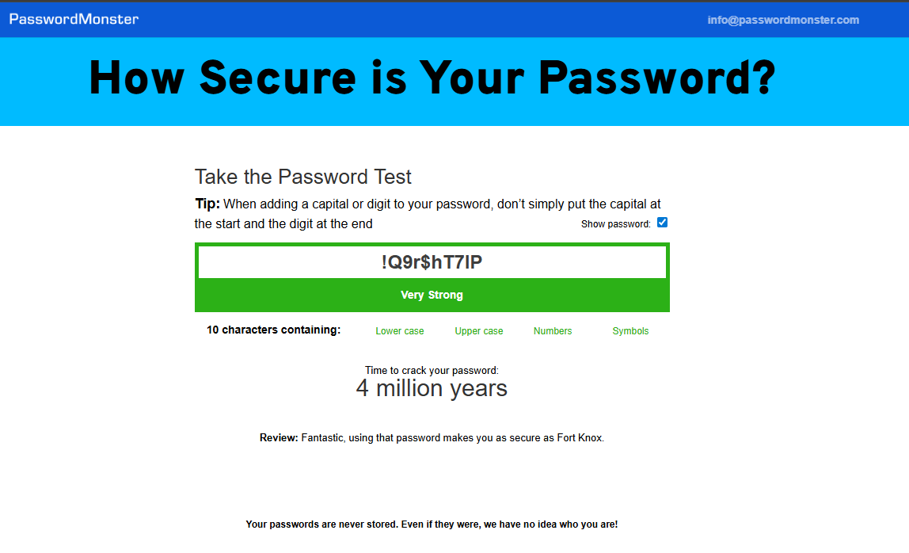
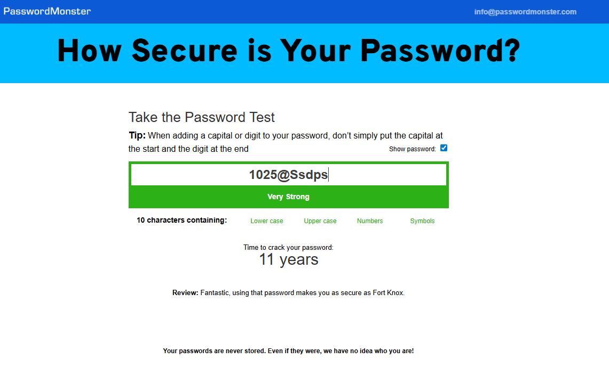
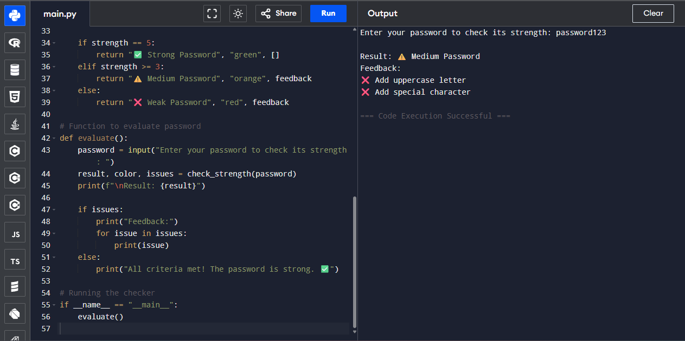
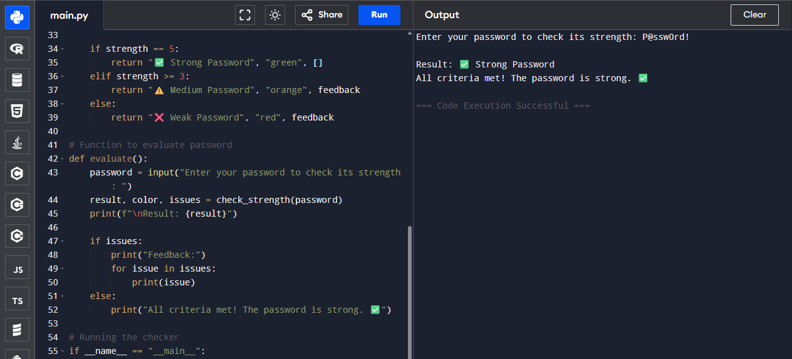
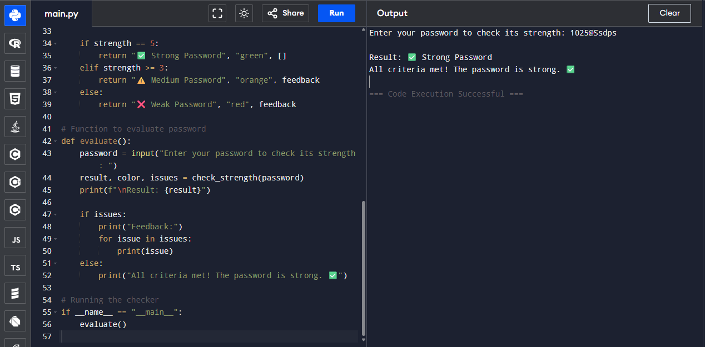

# Create a Strong Password and Evaluate Its Strength

## Introduction
In this task, the objective was to understand what makes a password strong and to evaluate the strength of different passwords using both online tools and a custom Python password strength checker I had previously developed. Password security is a critical component of cybersecurity, as weak passwords are often the easiest entry points for attackers.

To complete this task, I created multiple passwords with varying complexity, incorporating a mix of uppercase letters, lowercase letters, numbers, symbols, and different lengths. I then tested these passwords using a professional online password strength checker and my own Python script. The goal was to compare the results, analyze the feedback, and identify best practices for creating strong, secure passwords. Through this exercise, I also gained practical insights into how password complexity affects resistance to common attacks such as brute force and dictionary attacks.

## Tools Used
1. **Online Password Strength Checker**
   - A free online tool that evaluates the strength of a password and provides an estimate of how long it would take to crack it. The tool also highlights areas where a password could be improved.

2. **Custom Python Password Strength Checker**
   - A Python script I had previously developed and executed on an online Python code runner. This tool checks for essential criteria such as minimum length, presence of uppercase and lowercase letters, digits, and special characters. It provides a strength rating (Weak, Medium, Strong) along with specific feedback for improvement.

---

## Step 1: Creating and Testing Passwords on an Online Site (Explaination)

For this step, I created **four different passwords** with varying complexity and tested them using the online password strength checker [Password Monster](https://www.passwordmonster.com/). The objective was to observe how different combinations of uppercase letters, lowercase letters, numbers, symbols, and varying lengths affect password strength.

On the website, I entered each password into the input field and submitted it. The tool evaluated each password and provided the following information:

- **Character Composition:**  
  The site visually indicates whether the password contains uppercase letters, lowercase letters, numbers, and symbols. Initially, these indicators appear red and turn green as the password includes the respective character type. It also shows the total number of characters in the password.

- **Password Strength:**  
  A dynamic indicator displays the overall strength of the password, which changes in real-time depending on the complexity of the entered password.

- **Estimated Time to Crack:**  
  The site provides an estimate of how long it would take for an attacker to crack the password using typical brute-force or dictionary methods.

- **Review / Feedback:**  
  A short review is displayed, providing insight into how secure the password is and whether it is safe to use.

This process allowed me to test passwords of varying complexity and observe how the inclusion of different character types and lengths impacts both the strength score and the estimated time to crack.

---

## Step 2: Creating and Testing Passwords

### Password 1: `password123`

**Screenshot:**  

For the first test, I used the password `password123`, which is a simple and commonly used password. After entering it into the [Password Monster](https://www.passwordmonster.com/) online tool, the following results were observed:

- **Strength:** Very Weak  
- **Character Composition:** 11 characters, including lowercase letters and numbers (indicators turned green for these types)  
- **Time to Crack:** 0 seconds  
- **Review:** "Oh dear! Using that password is like leaving your front door wide open. Your password is very weak because it contains a common password and a sequence of characters."

**Observation:**  
This test clearly shows that common passwords and simple sequences are extremely weak, even if they include numbers. It reinforces the importance of avoiding dictionary words and predictable patterns.

---

### Password 2: `P@ssw0rd!`

**Screenshot:**  

For the second test, I created `P@ssw0rd!`, which is slightly more complex than the first password as it includes uppercase letters, a symbol, and a number. After testing it on [Password Monster](https://www.passwordmonster.com/), the results were:

- **Strength:** Very Weak  
- **Character Composition:** 9 characters, including uppercase letters, lowercase letters, numbers, and symbols (all indicators turned green for included types)  
- **Time to Crack:** 0 seconds  
- **Review:** "Oh dear! Using that password is like leaving your front door wide open. Your password is very weak because it contains a common password and a sequence of characters."

**Observation:**  
Even with the addition of uppercase letters, symbols, and numbers, this password remained very weak because it is a common variation of the word "password" and includes predictable sequences. This highlights the importance of avoiding not only simple words but also widely used variations that are easily guessed by attackers.

---

### Password 3: `!Q9r$hT7IP`

**Screenshot:**  

For the third test, I used `!Q9r$hT7IP`, a randomly generated password with mixed character types and no obvious dictionary words. After testing it on [Password Monster](https://www.passwordmonster.com/), the results were:

- **Strength:** Very Strong  
- **Character Composition:** 11 characters, including uppercase letters, lowercase letters, numbers, and symbols (indicators turned green)  
- **Estimated Time to Crack:** ~4 million years  
- **Review:** "Fantastic — using that password makes you as secure as Fort Knox."

**Observation:**  
This password demonstrates how randomness, length, and a mix of character types greatly increase strength. Even at 11 characters, the lack of predictable words or sequences makes it resistant to dictionary and pattern-based attacks.

---

### Password 4: `1025@Ssdps`

**Screenshot:**  

For the fourth test, I used `1025@Ssdps`, a password with a combination of uppercase letters, lowercase letters, numbers, and a symbol. After testing it on [Password Monster](https://www.passwordmonster.com/), the results were:

- **Strength:** Very Strong  
- **Character Composition:** 10 characters, including uppercase letters, lowercase letters, numbers, and symbols (all indicators turned green)  
- **Estimated Time to Crack:** ~11 years  
- **Review:** "Fantastic — using that password makes you as secure as Fort Knox."

**Observation:**  
This password shows that even shorter passwords can be strong if they use a good mix of characters and avoid common words or predictable patterns. It emphasizes the importance of combining different character types and avoiding dictionary-based words for enhanced security.

---

## Step 3: Testing Passwords Using Custom Python Checker

For this step, I used a password strength checker that I developed during my Prodigy Infotech internship. The script is available in my GitHub repository: [PRODIGY_CS_03](https://github.com/cybersecurity-Pro/PRODIGY_CS_03). This tool evaluates the strength of a password based on several key criteria.

### How the Code Works
1. **Password Length:**  
   The script checks if the password is at least 8 characters long. If not, it flags this as an issue.

2. **Lowercase Letters:**  
   It verifies the presence of at least one lowercase letter.

3. **Uppercase Letters:**  
   The presence of at least one uppercase letter is checked.

4. **Digits:**  
   The password must contain at least one numeric digit.

5. **Special Characters:**  
   The script ensures the inclusion of at least one special character (from the set `!@#$%^&*(),.?':{}|<>`).

6. **Strength Evaluation:**  
   - If all five criteria are met, the password is rated **Strong** ✅.  
   - If 3 or 4 criteria are met, it is rated **Medium** ⚠️.  
   - If fewer than 3 criteria are met, it is rated **Weak** ❌.

7. **Feedback:**  
   The script provides specific feedback for any missing criteria, helping users understand what to improve in their passwords.

### Usage
- The script is executed in a Python environment (or online Python runner).  
- Users input a password, and the script outputs the password strength along with detailed feedback on any criteria that were not met.  
- If all criteria are satisfied, it confirms that the password is strong with a success message.

This tool allowed me to **quickly evaluate multiple passwords locally** and compare the results with the online password strength checker.

---

### Password 1: `password123` (Python Checker)

**Screenshot:**  

For the first test using my custom Python password strength checker, I entered the password `password123`. The results were as follows:

- **Result:** ⚠️ Medium Password  
- **Feedback:**  
  - ❌ Add uppercase letter  
  - ❌ Add special character  

**Observation:**  
The checker highlighted that while the password meets the length and numeric criteria, it lacks uppercase letters and special characters. This reinforces the importance of including a mix of character types to increase password strength, even if numbers are present.

---

### Password 2: `P@ssw0rd!` (Python Checker)

**Screenshot:**  

For the second test using my custom Python password strength checker, I entered the password `P@ssw0rd!`. The results were as follows:

- **Result:** ✅ Strong Password  
- **Feedback:** All criteria met! The password is strong. ✅  

**Observation:**  
This password meets all the standard criteria: it has sufficient length, includes lowercase and uppercase letters, numbers, and special characters. However, the results differ when tested with the online strength checker because my custom code does not evaluate susceptibility to dictionary attacks. Despite fulfilling complexity rules, this password remains relatively easy to crack if an attacker uses a dictionary-based approach.

---

### Password 3: `!Q9r$hT7IP` (Python Checker)

**Screenshot:**

For the third test using my custom Python password strength checker, I entered the password `!Q9r$hT7IP`. The results were as follows:

- **Result:** ✅ Strong Password  
- **Feedback:** All criteria met! The password is strong. ✅

**Observation:**  
This password meets all the required criteria: sufficient length, lowercase letters, uppercase letters, numbers, and special characters. The checker confirmed that it is strong, which aligns with the results from the online tool, highlighting consistency between my custom Python checker and professional online tools.

---

### Password 4: `1025@Ssdps` (Python Checker)

**Screenshot:**  

For the fourth test using my custom Python password strength checker, I used the password `1025@Ssdps`, which was also tested previously on the online password strength site. The results were:

- **Result:** ✅ Strong Password  
- **Feedback:** All criteria met! The password is strong. ✅  

**Observation:**  
This password meets all the required criteria: sufficient length, lowercase letters, uppercase letters, numbers, and special characters. The checker confirmed that it is strong, which aligns with the results from the online tool, highlighting consistency between my custom Python checker and professional online tools.

---

## Step 4: Analysis, Best Practices, and Common Password Attacks

### 4.1 Results Comparison
I tested passwords using both **Password Monster** (online) and my **Python checker**:

| Password       | Online Tool       | Python Checker          | Notes |
|----------------|-----------------|------------------------|-------|
| `password123`  | Very Weak (0 sec) | Medium — missing uppercase & special | Online tool flagged it as common & sequential |
| `P@ssw0rd!`    | Very Weak (0 sec) | Strong — all criteria met | Online tool detects common patterns which Python checker can't detect |
| `!Q9r$hT7IP`   | Very Strong (~4 million years) | Strong — all criteria met | Random + mixed characters = extremely strong |
| `1025@Ssdps`   | Very Strong (~11 years) | Strong — all criteria met | Both tools agree; consistent results |

**Observation:** Online tools consider pattern/common-word attacks; my checker focuses on character composition.

---

### 4.2 Tips Learned & Best Practices
- Use **12–16+ characters**; longer passwords are exponentially harder to crack.  
- Mix **uppercase, lowercase, digits, and symbols**, but avoid predictable placements.  
- Avoid **dictionary words, common sequences, names, or birthdays**.  
- Consider **passphrases** or random strings.  
- Use **unique passwords** for each account; a password manager helps.  
- Enable **Multi-Factor Authentication (MFA)** wherever possible.

---

### 4.3 Common Password Attacks
- **Brute-force:** Tries all combinations; length and character variety matter most.  
- **Dictionary attacks:** Uses common words, names, or leaked passwords; predictable patterns are vulnerable.  
- **Credential stuffing:** Reusing passwords across sites can lead to compromise.  
- **Hybrid & rainbow-table attacks:** Combine dictionary + patterns or precomputed hash tables.  

**Key takeaway:** Longer, random, and complex passwords resist most common attacks.  

---

## Conclusion

Password strength depends on both **composition and unpredictability**. Basic criteria (length + character variety) are important, but avoiding patterns and using unique passwords with MFA ensures the highest security. My Python checker helps evaluate composition, while online tools add pattern-based insights.

