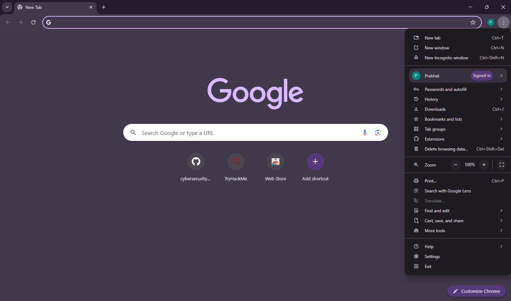
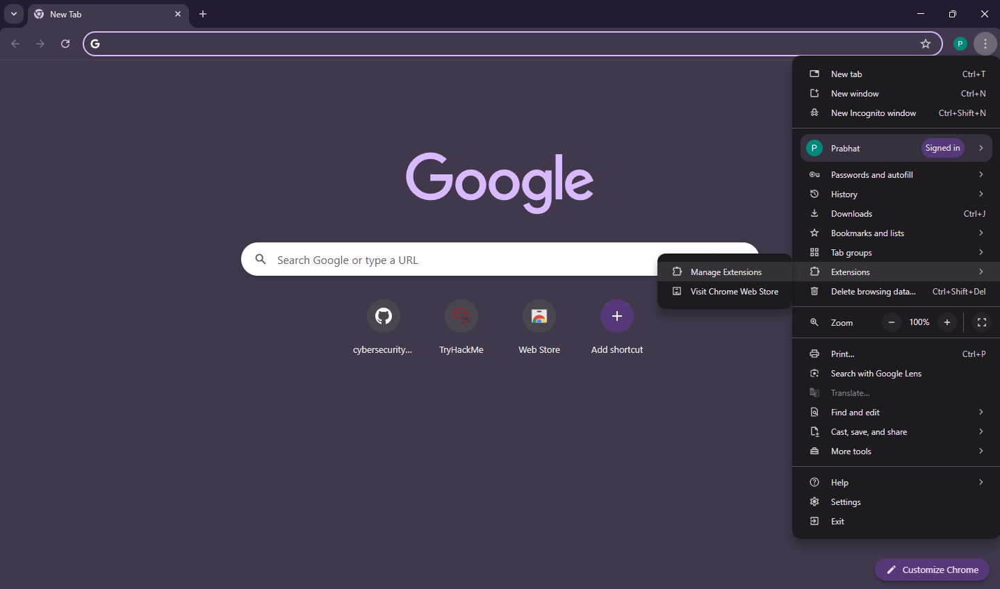
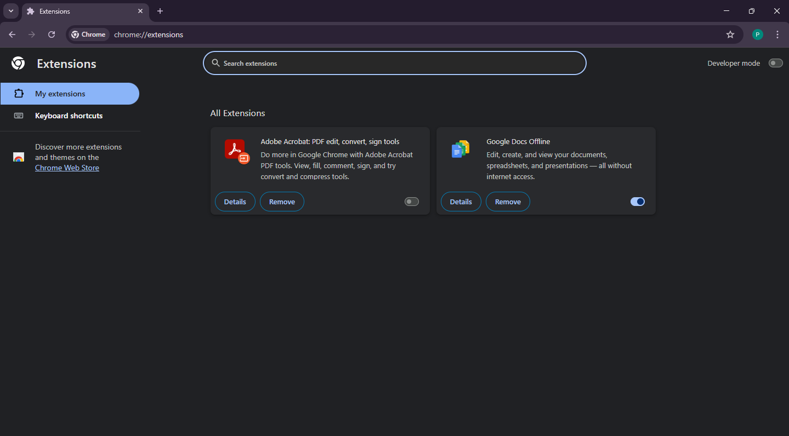
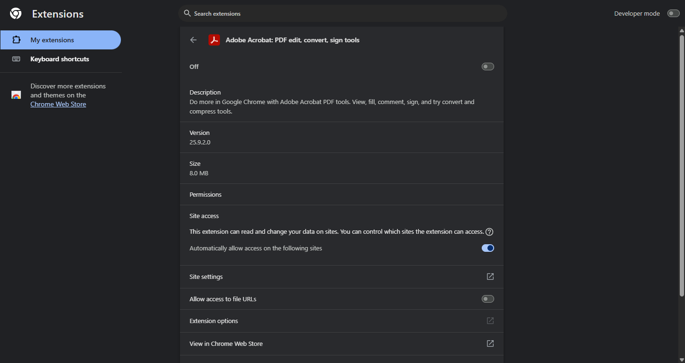
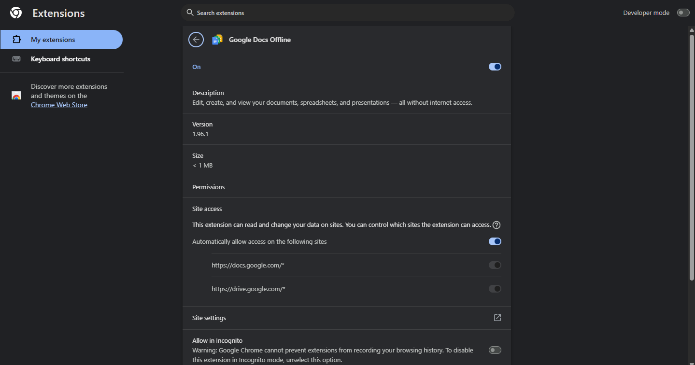
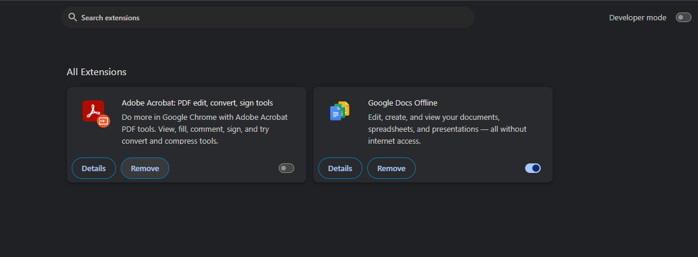

# Identify and Remove Suspicious Browser Extensions

## Introduction
The purpose of this task was to review installed browser extensions, identify any suspicious or unnecessary ones, and remove them if required. Malicious extensions can compromise user security by stealing credentials, injecting ads, or monitoring browsing activity. By performing this task, the objective was to practice good security hygiene and understand how to evaluate browser extensions for legitimacy.

## Tools Used
- Google Chrome (Windows 10/11)
- Chrome Extension Manager (chrome://extensions/)

---

## Steps Taken

### Step 1: Open Extensions Manager
I used my second Google account for this task since it had more than the default extension.  
To access the extension manager in Chrome:  
1. Click on the three-dot menu in the top right corner.

**Screenshot:**

3. Navigate to **Extensions > Manage Extensions**.  

**Screenshot:**

4. This opens the full list of installed extensions.  

**Screenshot:**

In my case, I checked all my Chrome accounts:  
- Most accounts only had the **default Google Docs Offline** extension installed.  
- Only this second account had two extensions, which is why I chose it for the task.  
- Even here, there were no suspicious extensions found.  

---

### Step 2: Review Installed Extensions
After opening the extension manager, I reviewed all installed extensions. In this account, there were only two:

1. **Adobe Acrobat: PDF edit, convert, sign tools**

**Screenshot:**

   - Status: Turned off  
   - Permissions: Can read and change data on websites, access file URLs (if enabled)  
   - Publisher: Adobe Systems  
   - Finding: This is an official Adobe extension, widely used and trusted. Although it requires broad permissions, it is considered safe as long as it comes from the official source.

2. **Google Docs Offline**  

**Screenshot:**

   - Status: Enabled  
   - Permissions: Can read and change data on Google Docs/Drive sites (docs.google.com, drive.google.com)  
   - Publisher: Google LLC  
   - Finding: This is the default extension by Google for offline editing of Docs/Sheets. It is safe and commonly pre-installed in Chrome profiles.

**Results:**  
- No suspicious or harmful extensions were found.  
- Both installed extensions were from trusted publishers (Adobe & Google).  
- No removal action was necessary.

**Screenshot:**

If you find a suspicious extension, you can remove it by clicking **Remove** in the Extensions menu, and then restart the Chrome browser.

---

### Step 3: Research on Malicious Extensions
While no suspicious extensions were detected, I researched how malicious browser extensions can potentially harm users:  
- **Data Theft:** Extensions can capture browsing history, saved passwords, or form inputs.  
- **Ad Injection:** Malicious extensions may insert ads, pop-ups, or redirect traffic to unwanted sites.  
- **Credential Stealing:** Some inject malicious scripts to capture login credentials.  
- **Tracking & Privacy Invasion:** Extensions may track user activity across websites without consent.  
- **Malware Delivery:** Extensions can download and execute malicious payloads in the background.  

Understanding these risks highlights why it is important to periodically review installed extensions.

---

## Final Observations
- No suspicious or malicious extensions were found during this review.  
- Both installed extensions (Adobe Acrobat and Google Docs Offline) are official and safe.  
- Since no unnecessary or harmful extensions were present, no removal was required.  
- This task reinforced the importance of regularly checking browser extensions, as malicious ones can exploit permissions to steal data, track activity, or inject unwanted content.

---

## Conclusion
The browser was already clean, containing only legitimate extensions from trusted publishers.  
Although no suspicious extensions were detected, the exercise helped practice the process of:  
1. Accessing the extension manager  
2. Reviewing installed extensions and their permissions  
3. Evaluating the trustworthiness of extensions  
4. Researching how malicious extensions operate  

This strengthens security awareness and ensures good browser hygiene.
