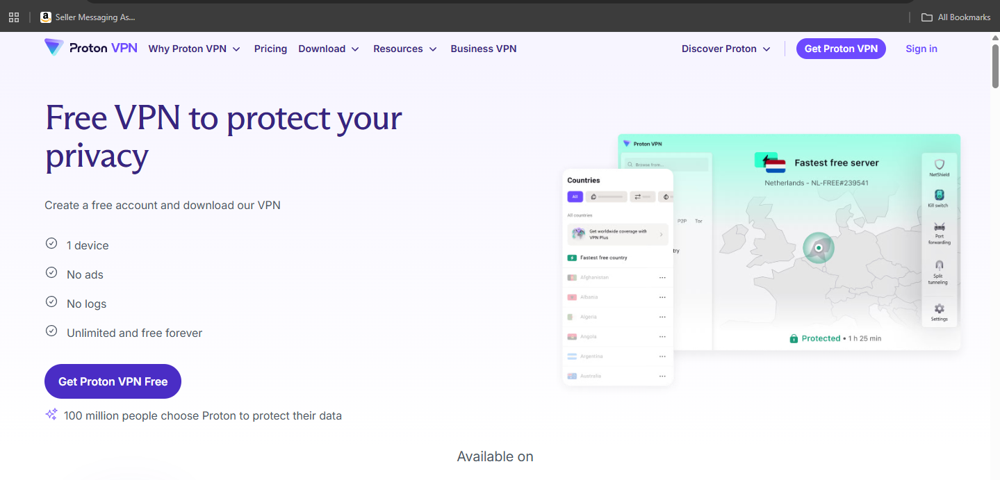
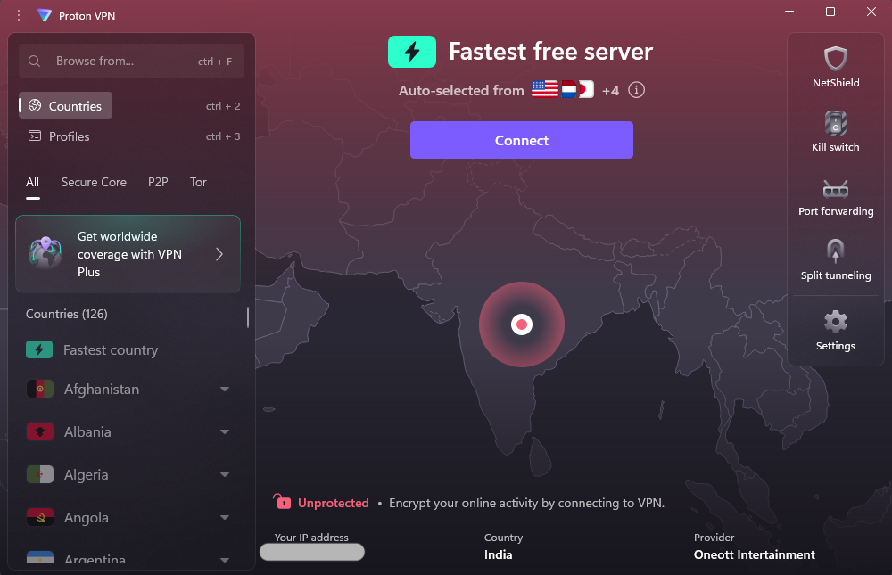
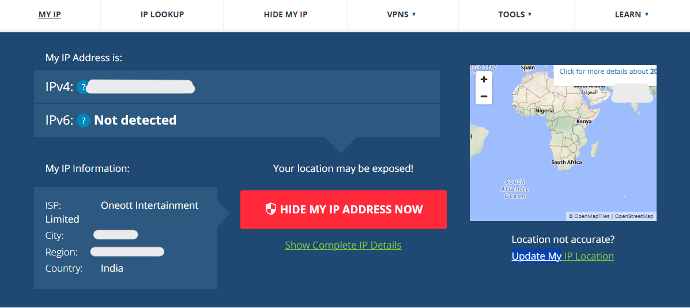
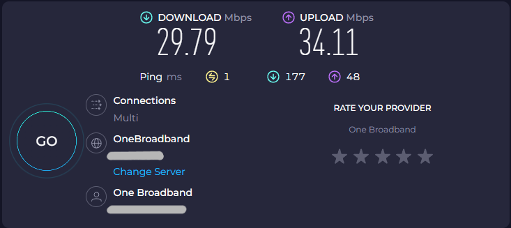
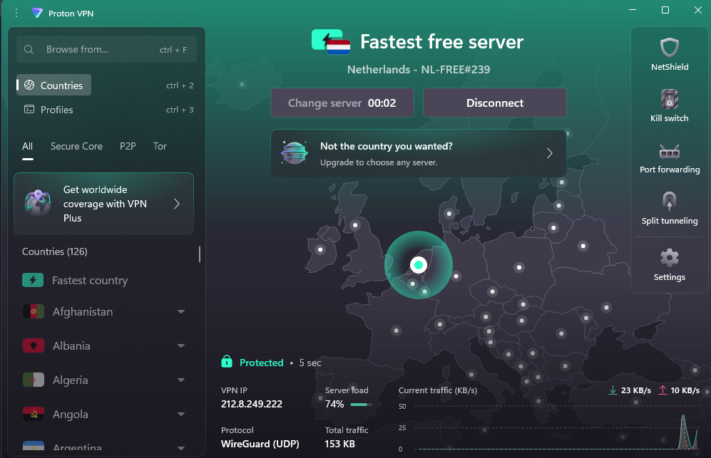
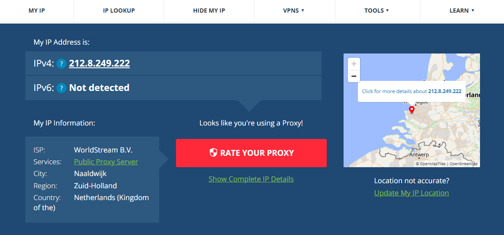
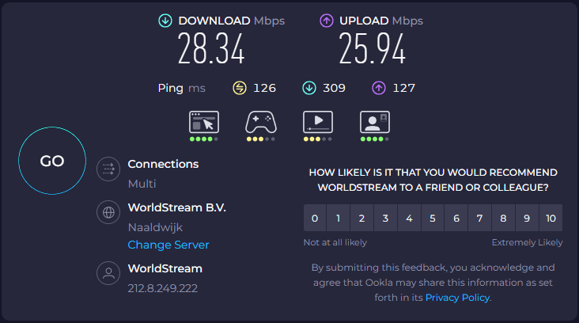
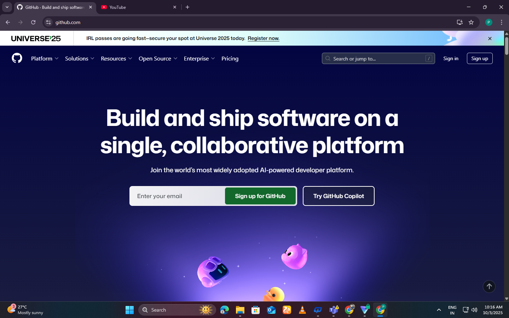
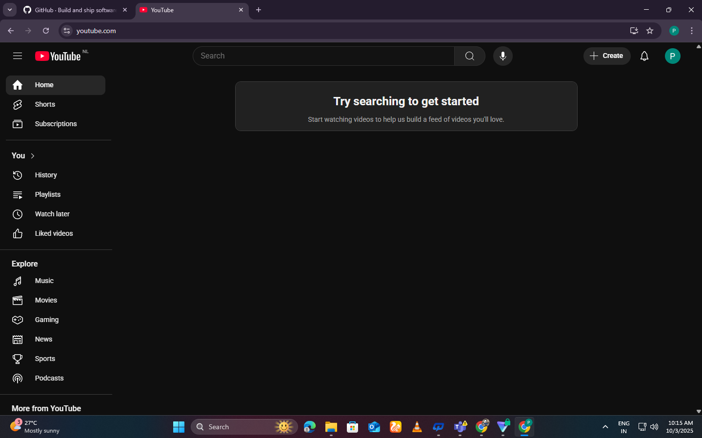

# Working with VPNs

## Introduction
The objective of this task was to understand the role of Virtual Private Networks (VPNs) in protecting privacy and ensuring secure communication.  
A VPN masks the user’s real IP address, encrypts internet traffic, and routes it through a secure server, enhancing online privacy and security.  

## Tools Used
- **ProtonVPN (Free Tier)** – Selected for its strong reputation, no-logs policy, and availability of free servers.  
- **WhatIsMyIPAddress.com** – Used to check public IP address before and after VPN connection.  
- **Speedtest.net** – Used to measure and compare internet speed before and after VPN connection.  
- **Google Chrome Browser** – Used for browsing activity verification (GitHub, YouTube).  

---

## Step 1 – Install and Sign In to VPN

For this task, we used **ProtonVPN Free Tier**, which is reliable and has a no-logs policy.  
**Screenshot:**

1. **Sign Up:**  
   - Visited [ProtonVPN website](https://protonvpn.com/) and created a free account using a Gmail address.  
   - Verified the account via email.  

2. **Download and Install VPN Client:**  
   - Downloaded the ProtonVPN application for Windows from the official website.  
   - Ran the installer and followed on-screen instructions.  

3. **Log In to VPN Client:**  
   - Opened the installed VPN client.  
   - Entered the credentials created during signup.  
   - Successfully logged in and accessed the VPN interface.  

**Observation:** The client was ready to connect to available free servers.  

**Screenshot:**

---

## Step 2 – Check IP and Internet Speed Before VPN

Before connecting to the VPN, we verified the current network details:

1. **Check Public IP:**  
   - Visited [WhatIsMyIPAddress.com](https://whatismyipaddress.com/) to note the public IP address.  
   - **Observation:** IP showed `202.xxx.xxx.xxx` (local ISP).  
   - **Screenshot:**

      

2. **Run Internet Speed Test:**  
   - Used [Speedtest.net](https://www.speedtest.net) to measure download and upload speed.  
   - **Observation:** Download speed: 29.79 Mbps, Upload speed: 34.11 Mbps.  
   - **Screenshot:**

      

---

## Step 3 – Connect to VPN and Verify

1. **Connect to VPN:**  
   - Opened the ProtonVPN client.  
   - Clicked the **Fastest Free Option** button.  
   - The client connected to a server in **Netherlands**, assigning a new IP address.  
   - **Screenshot:**

      

2. **Check IP After VPN:**  
   - Visited [WhatIsMyIPAddress.com](https://whatismyipaddress.com/) again.  
   - **Observation:** IP changed to a Netherlands-based address, confirming the VPN connection.  
   - **Screenshot:**
    
     

3. **Run Internet Speed Test After VPN:**  
   - Used [Speedtest.net](https://www.speedtest.net) to check performance while connected to VPN.  
   - **Observation:** Download speed: 28.34 Mbps, Upload speed: 25.94 Mbps. Slight decrease due to VPN encryption overhead.  
   - **Screenshot:**

     

---

## Step 4 – Verify Browsing and Disconnect VPN

1. **Verify Secure Browsing:**  
   - While connected to the VPN, visited the following websites to ensure traffic was routed securely:  
     - **GitHub** – Website loaded normally.
        
         

     - **YouTube** – Website loaded normally.  

         

    - **Observation:** Both websites loaded without issues, confirming VPN was functioning and traffic was encrypted.

3. **Disconnect VPN:**  
   - Disconnected from ProtonVPN using the client interface.  
   - Optional check: revisit [WhatIsMyIPAddress.com](https://whatismyipaddress.com/) to confirm IP reverted to the original ISP address.  

---

## Step 5 – Compare IP and Internet Speed With and Without VPN

After completing the VPN session, we compared the network details before and after connecting to VPN:

1. **IP Address Comparison:**  
   - **Without VPN:** 202.xxx.xxx.xxx (local ISP)  
   - **With VPN (Netherlands):** 212.8.249.222  
   - **Observation:** The IP changed to a different country, confirming the VPN connection successfully masked the original IP.

2. **Internet Speed Comparison:**  
   | Metric          | Without VPN | With VPN (Netherlands) |
   |-----------------|------------|-----------------------|
   | Download Speed  | 29.79 Mbps | 28.34 Mbps            |
   | Upload Speed    | 34.11 Mbps | 25.94 Mbps            |
   - **Observation:** Slight decrease in speed due to encryption overhead, which is normal for VPN usage.
  

---

## Step 6 – Research and Summary

**VPN Encryption and Privacy Features:**  
- VPNs encrypt internet traffic using protocols like **OpenVPN, IKEv2, or WireGuard**, preventing eavesdropping.  
- They hide your real IP address from websites and ISPs, reducing tracking and location-based profiling.  
- Free VPNs may have **speed limitations or server restrictions**, unlike premium versions.  
- While VPNs enhance privacy, they **cannot protect against malware or phishing** on visited sites.  
- **Important:** VPNs do **not provide complete anonymity**—the VPN provider can still see your real IP and activity.

**Benefits:**  
- Masks real IP address and location  
- Encrypts traffic for secure communication  
- Allows access to region-restricted content  
- Protects privacy on public Wi-Fi  

**Limitations:**  
- Free versions may have limited bandwidth or server options  
- Slight decrease in internet speed due to encryption  
- Cannot replace antivirus or safe browsing practices  
- Some VPNs may log user activity (check provider policies)

---

## Conclusion

In this task, we gained hands-on experience using a VPN to enhance online privacy and security.  
We successfully installed ProtonVPN, connected to a server in the Netherlands, verified IP address change, and observed internet speed before and after VPN connection. Browsing websites like GitHub and YouTube while connected confirmed that traffic was routed securely.  

Through this exercise, we learned that VPNs:  
- Encrypt internet traffic to prevent eavesdropping  
- Hide the real IP address from websites and ISPs  
- Allow access to region-restricted content  

However, VPNs have limitations, such as reduced speed, limited free server options, and the fact that VPN providers can still see user activity. Overall, VPNs are valuable tools for improving privacy and security online, but they should be used alongside other safe browsing practices.

